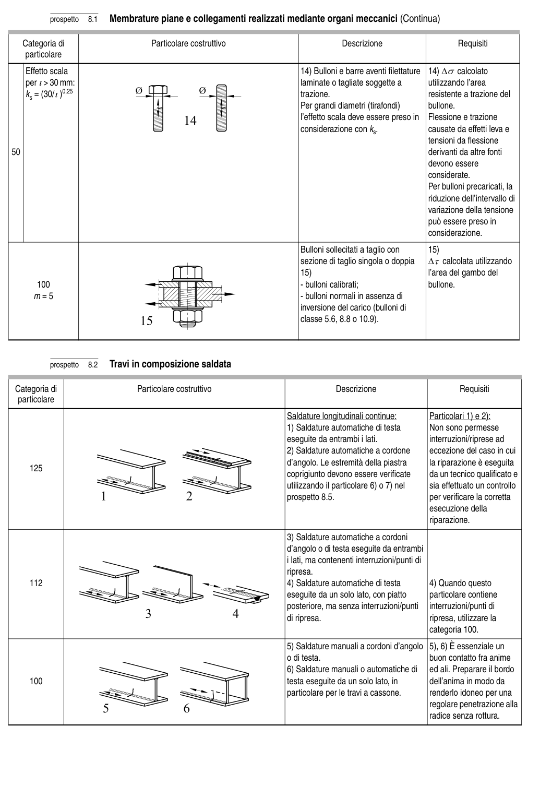

# 8 — Catalogo dei particolari costruttivi — pagina PDF 24

Fonte: [UNI EN 1993-1-9:2005 — Fatica](../../sources/ec3.pdf#page=24). Pagina stampata: 19.

> Formule, simboli e associazioni delle tabelle non sono convalidati per il calcolo.

## Testo estratto

prospetto   8.1  Membrature piane e collegamenti realizzati mediante organi meccanici (Continua)

Categoria di                          Particolare costruttivo                               Descrizione                       Requisiti particolare

```text
    Effetto scala                                                              14) Bulloni e barre aventi filettature  14) ∆σ calcolato
    per ι> 30 mm:                                                              laminate o tagliate soggette a        utilizzando l’area
    ks = (30/ι)0,25                                                                     trazione.                             resistente a trazione del
                                                                          Per grandi diametri (tirafondi)        bullone.
                                                                                                         l’effetto scala deve essere preso in  Flessione e trazione
                                                                              considerazione con ks.             causate da effetti leva e
                                                                                                                             tensioni da flessione
50                                                                                                                              derivanti da altre fonti
                                                                                                    devono essere
                                                                                                                       considerate.
                                                                                                           Per bulloni precaricati, la
                                                                                                                       riduzione dell’intervallo di
                                                                                                                      variazione della tensione
                                                                                                 può essere preso in
                                                                                                                    considerazione.
```

```text
                                                                                       Bulloni sollecitati a taglio con        15)
                                                                            sezione di taglio singola o doppia  ∆τ calcolata utilizzando
                                                                              15)                                     l’area del gambo del
      100                                                                                                 - bulloni calibrati;                     bullone.
   m = 5                                                                                                - bulloni normali in assenza di
                                                                                   inversione del carico (bulloni di
                                                                               classe 5.6, 8.8 o 10.9).
```

prospetto   8.2   Travi in composizione saldata

Categoria di                        Particolare costruttivo                                  Descrizione                         Requisiti particolare

```text
                                                                           Saldature longitudinali continue:          Particolari 1) e 2):
                                                                                1) Saldature automatiche di testa      Non sono permesse
                                                                           eseguite da entrambi i lati.                interruzioni/riprese ad
                                                                                2) Saldature automatiche a cordone     eccezione del caso in cui
                                                                                d’angolo. Le estremità della piastra       la riparazione è eseguita
    125
                                                                                coprigiunto devono essere verificate    da un tecnico qualificato e
                                                                                   utilizzando il particolare 6) o 7) nel       sia effettuato un controllo
                                                                             prospetto 8.5.                         per verificare la corretta
                                                                                                           esecuzione della
                                                                                                                            riparazione.
```

```text
                                                                                3) Saldature automatiche a cordoni
                                                                           d’angolo o di testa eseguite da entrambi
                                                                                                                                                                i lati, ma contenenti interruzioni/punti di
                                                                                     ripresa.
    112                                                                       4) Saldature automatiche di testa        4) Quando questo
                                                                           eseguite da un solo lato, con piatto       particolare contiene
                                                                                   posteriore, ma senza interruzioni/punti   interruzioni/punti di
                                                                                            di ripresa.                                 ripresa, utilizzare la
                                                                                                                      categoria 100.
```

```text
                                                                                5) Saldature manuali a cordoni d’angolo  5), 6) È essenziale un
                                                                o di testa.                         buon contatto fra anime
                                                                                6) Saldature manuali o automatiche di   ed ali. Preparare il bordo
    100                                                                         testa eseguite da un solo lato, in         dell’anima in modo da
                                                                                   particolare per le travi a cassone.        renderlo idoneo per una
                                                                                                                      regolare penetrazione alla
                                                                                                                       radice senza rottura.
```

## Tabelle e dettagli

- [ec3-024-t01-d01](../details/ec3-024-t01-d01.md) — 50; Effetto scala; per ι> 30 mm:; ks = (30/ι)0,25
- [ec3-024-t01-d02](../details/ec3-024-t01-d02.md) — 100; m = 5
- [ec3-024-t02-d01-01](../details/ec3-024-t02-d01-01.md) — 125
- [ec3-024-t02-d01-02](../details/ec3-024-t02-d01-02.md) — 125
- [ec3-024-t02-d02-01](../details/ec3-024-t02-d02-01.md) — 112
- [ec3-024-t02-d02-02](../details/ec3-024-t02-d02-02.md) — 112
- [ec3-024-t02-d03-01](../details/ec3-024-t02-d03-01.md) — 100
- [ec3-024-t02-d03-02](../details/ec3-024-t02-d03-02.md) — 100

## Pagina di riscontro


