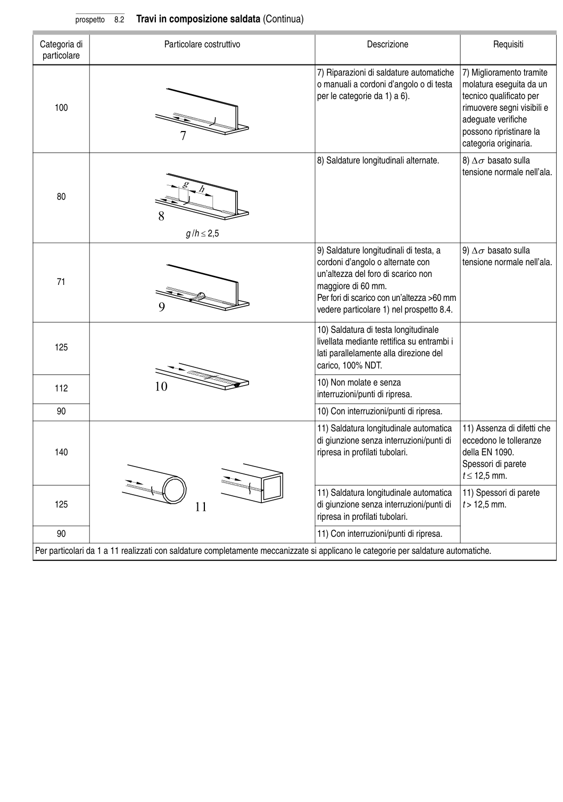

# 8 — Catalogo dei particolari costruttivi — pagina PDF 25

Fonte: [UNI EN 1993-1-9:2005 — Fatica](../../sources/ec3.pdf#page=25). Pagina stampata: 20.

> Formule, simboli e associazioni delle tabelle non sono convalidati per il calcolo.

## Testo estratto

prospetto   8.2   Travi in composizione saldata (Continua)

Categoria di                        Particolare costruttivo                                  Descrizione                         Requisiti particolare

```text
                                                                                7) Riparazioni di saldature automatiche  7) Miglioramento tramite
                                                                o manuali a cordoni d’angolo o di testa   molatura eseguita da un
                                                                          per le categorie da 1) a 6).               tecnico qualificato per
    100                                                                                                      rimuovere segni visibili e
                                                                                                        adeguate verifiche
                                                                                                    possono ripristinare la
                                                                                                                      categoria originaria.
```

8) Saldature longitudinali alternate.       8) ∆σ basato sulla tensione normale nell’ala.

80

g /h ≤ 2,5

```text
                                                                                9) Saldature longitudinali di testa, a      9) ∆σ basato sulla
                                                                            cordoni d’angolo o alternate con         tensione normale nell’ala.
                                                                               un’altezza del foro di scarico non
     71                                                                     maggiore di 60 mm.
                                                                        Per fori di scarico con un’altezza >60 mm
                                                                       vedere particolare 1) nel prospetto 8.4.
```

10) Saldatura di testa longitudinale livellata mediante rettifica su entrambi i 125 lati parallelamente alla direzione del carico, 100% NDT.

```text
                                                                          10) Non molate e senza
    112
                                                                                       interruzioni/punti di ripresa.
```

90                                                                  10) Con interruzioni/punti di ripresa.

```text
                                                                          11) Saldatura longitudinale automatica   11) Assenza di difetti che
                                                                                            di giunzione senza interruzioni/punti di   eccedono le tolleranze
    140                                                                        ripresa in profilati tubolari.                della EN 1090.
                                                                                                               Spessori di parete
                                                                                                                                                                                                  t ≤ 12,5 mm.
```

```text
                                                                          11) Saldatura longitudinale automatica   11) Spessori di parete
    125                                                                                 di giunzione senza interruzioni/punti di     t > 12,5 mm.
                                                                                  ripresa in profilati tubolari.
```

90                                                                  11) Con interruzioni/punti di ripresa.

Per particolari da 1 a 11 realizzati con saldature completamente meccanizzate si applicano le categorie per saldature automatiche.

## Tabelle e dettagli

- [ec3-025-t01-d01](../details/ec3-025-t01-d01.md) — 100
- [ec3-025-t01-d02](../details/ec3-025-t01-d02.md) — 80
- [ec3-025-t01-d03](../details/ec3-025-t01-d03.md) — 71
- [ec3-025-t01-d04](../details/ec3-025-t01-d04.md) — 125; 112; 90
- [ec3-025-t01-d05](../details/ec3-025-t01-d05.md) — 140; 125; 90

## Pagina di riscontro


