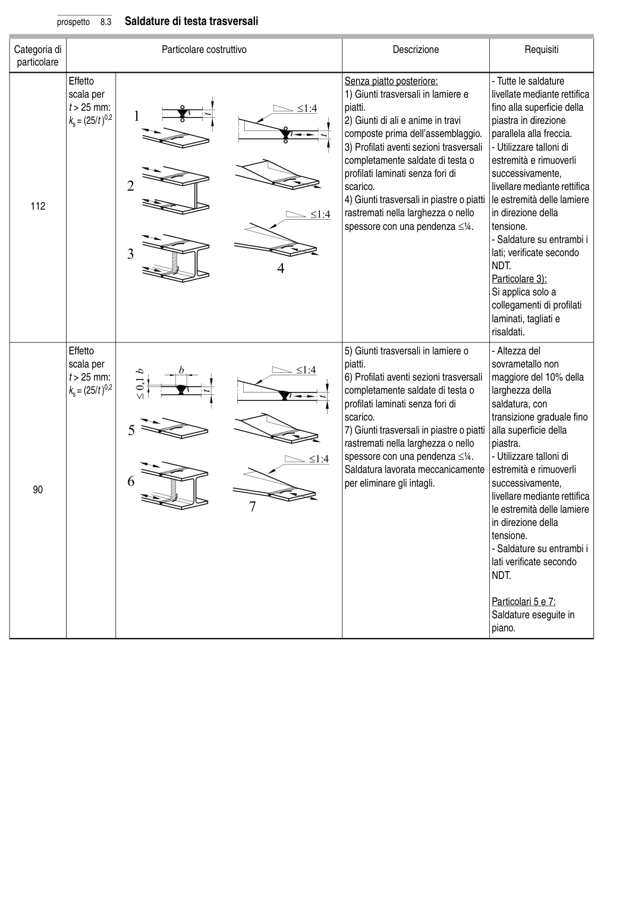

# 8 — Catalogo dei particolari costruttivi — pagina PDF 26

Fonte: [UNI EN 1993-1-9:2005 — Fatica](../../sources/ec3.pdf#page=26). Pagina stampata: 21.

> Formule, simboli e associazioni delle tabelle non sono convalidati per il calcolo.

## Testo estratto

prospetto   8.3   Saldature di testa trasversali

Categoria di                          Particolare costruttivo                                   Descrizione                       Requisiti particolare

```text
               Effetto                                                  Senza piatto posteriore:                  - Tutte le saldature
             scala per                                                             1) Giunti trasversali in lamiere e       livellate mediante rettifica
                      t > 25 mm:                                                                              piatti.                                   fino alla superficie della
             ks= (25/t )0,2                                                           2) Giunti di ali e anime in travi        piastra in direzione
                                                                     composte prima dell’assemblaggio.   parallela alla freccia.
                                                                                    3) Profilati aventi sezioni trasversali   - Utilizzare talloni di
                                                                       completamente saldate di testa o    estremità e rimuoverli
                                                                                                        profilati laminati senza fori di        successivamente,
                                                                                        scarico.                                   livellare mediante rettifica
                                                                                    4) Giunti trasversali in piastre o piatti  le estremità delle lamiere
   112
                                                                                    rastremati nella larghezza o nello     in direzione della
                                                                          spessore con una pendenza ≤1⁄4.     tensione.
                                                                                                                                                                  - Saldature su entrambi i
                                                                                                                                                                              lati; verificate secondo
                                                                                                  NDT.
                                                                                                                             Particolare 3):
                                                                                                                          Si applica solo a
                                                                                                                    collegamenti di profilati
                                                                                                                                   laminati, tagliati e
                                                                                                                                                 risaldati.
```

```text
               Effetto                                                               5) Giunti trasversali in lamiere o        - Altezza del
             scala per                                                                                piatti.                              sovrametallo non
                      t > 25 mm:                                                           6) Profilati aventi sezioni trasversali  maggiore del 10% della
             ks= (25/t )0,2                                                  completamente saldate di testa o    larghezza della
                                                                                                        profilati laminati senza fori di         saldatura, con
                                                                                        scarico.                              transizione graduale fino
                                                                                    7) Giunti trasversali in piastre o piatti  alla superficie della
                                                                                    rastremati nella larghezza o nello     piastra.
                                                                          spessore con una pendenza ≤1⁄4.      - Utilizzare talloni di
                                                                               Saldatura lavorata meccanicamente  estremità e rimuoverli
                                                                              per eliminare gli intagli.             successivamente,
    90
                                                                                                                                                 livellare mediante rettifica
                                                                                                                                           le estremità delle lamiere
                                                                                                                                           in direzione della
                                                                                                                        tensione.
                                                                                                                                                                  - Saldature su entrambi i
                                                                                                                                                                         lati verificate secondo
                                                                                                  NDT.
```

```text
                                                                                                                                     Particolari 5 e 7:
                                                                                                                  Saldature eseguite in
                                                                                                                         piano.
```

## Tabelle e dettagli

- [ec3-026-t01-d01-01](../details/ec3-026-t01-d01-01.md) — 112
- [ec3-026-t01-d01-02](../details/ec3-026-t01-d01-02.md) — 112
- [ec3-026-t01-d01-03](../details/ec3-026-t01-d01-03.md) — 112
- [ec3-026-t01-d01-04](../details/ec3-026-t01-d01-04.md) — 112
- [ec3-026-t01-d02-01](../details/ec3-026-t01-d02-01.md) — 90
- [ec3-026-t01-d02-02](../details/ec3-026-t01-d02-02.md) — 90
- [ec3-026-t01-d02-03](../details/ec3-026-t01-d02-03.md) — 90

## Pagina di riscontro


