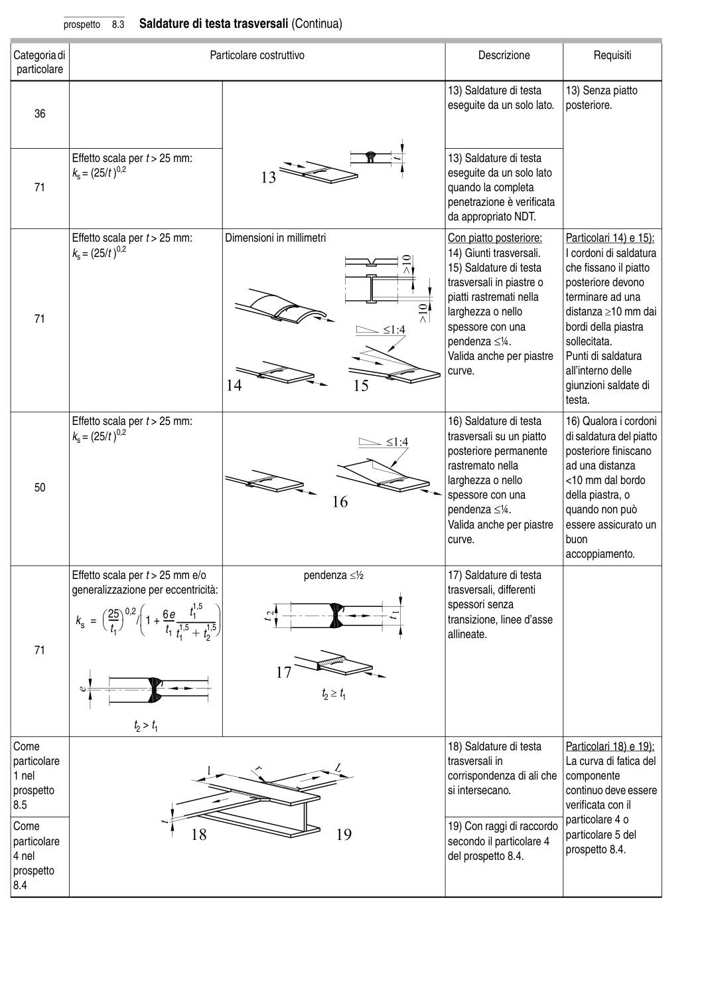

# 8 — Catalogo dei particolari costruttivi — pagina PDF 28

Fonte: [UNI EN 1993-1-9:2005 — Fatica](../../sources/ec3.pdf#page=28). Pagina stampata: 23.

> Formule, simboli e associazioni delle tabelle non sono convalidati per il calcolo.

## Testo estratto

prospetto   8.3   Saldature di testa trasversali (Continua)

Categoria di                                  Particolare costruttivo                                     Descrizione               Requisiti particolare

```text
                                                                                           13) Saldature di testa     13) Senza piatto
                                                                                             eseguite da un solo lato.   posteriore.
    36
```

```text
               Effetto scala per t > 25 mm:                                                      13) Saldature di testa
              ks = (25/t )0,2                                                                     eseguite da un solo lato
    71                                                                         quando la completa
                                                                                            penetrazione è verificata
                                                                               da appropriato NDT.
```

```text
               Effetto scala per t > 25 mm:       Dimensioni in millimetri                    Con piatto posteriore:      Particolari 14) e 15):
              ks = (25/t )0,2                                                                    14) Giunti trasversali.         I cordoni di saldatura
                                                                                           15) Saldature di testa     che fissano il piatto
                                                                                                           trasversali in piastre o     posteriore devono
                                                                                                                             piatti rastremati nella      terminare ad una
                                                                                            larghezza o nello         distanza ≥10 mm dai
    71
                                                                                       spessore con una         bordi della piastra
                                                                                pendenza ≤1⁄4.              sollecitata.
                                                                                                  Valida anche per piastre   Punti di saldatura
                                                                                                 curve.                        all’interno delle
                                                                                                                                giunzioni saldate di
                                                                                                                                         testa.
```

```text
               Effetto scala per t > 25 mm:                                                      16) Saldature di testa     16) Qualora i cordoni
              ks = (25/t )0,2                                                                               trasversali su un piatto     di saldatura del piatto
                                                                                                   posteriore permanente    posteriore finiscano
                                                                                            rastremato nella         ad una distanza
                                                                                            larghezza o nello        <10 mm dal bordo
    50
                                                                                       spessore con una          della piastra, o
                                                                                pendenza ≤1⁄4.          quando non può
                                                                                                  Valida anche per piastre   essere assicurato un
                                                                                                 curve.                 buon
                                                                                                                accoppiamento.
```

```text
               Effetto scala per t > 25 mm e/o                  pendenza ≤1⁄2                  17) Saldature di testa
             generalizzazione per eccentricità:                                                          trasversali, differenti
                                                      1,5                                                     spessori senza
                                                                                                                         t1                          6e                         0,2                                                                                                        transizione,                                                                                                                     linee d’asse                                                -----                                             /                        1 +                                                                              ------                                                                     -----------------                                                                                                                         1,5              ks =  25                                                  t1                                          t1                                                                                                                                                                                      allineate.                                             t1                        + t21,5
    71
```

t2 ≥t1

t2 > t1

```text
Come                                                                                      18) Saldature di testa      Particolari 18) e 19):
particolare                                                                                                trasversali in           La curva di fatica del
1 nel                                                                                      corrispondenza di ali che  componente
prospetto                                                                                                               si intersecano.            continuo deve essere
8.5                                                                                                                                         verificata con il
                                                                                                                                   particolare 4 o
Come                                                                                      19) Con raggi di raccordo
                                                                                                                                   particolare 5 del
particolare                                                                         secondo il particolare 4
                                                                                                                         prospetto 8.4.
4 nel                                                                                              del prospetto 8.4.
prospetto
8.4
```

## Tabelle e dettagli

- [ec3-028-t01-d01](../details/ec3-028-t01-d01.md) — Come; particolare; 1 nel; prospetto; 8.5; Come; particolare; 4 nel; prospetto; 8.4
- [ec3-028-t01-d02](../details/ec3-028-t01-d02.md) — 36; 71
- [ec3-028-t01-d03-01](../details/ec3-028-t01-d03-01.md) — 71
- [ec3-028-t01-d03-02](../details/ec3-028-t01-d03-02.md) — 71
- [ec3-028-t01-d04](../details/ec3-028-t01-d04.md) — 50
- [ec3-028-t01-d05](../details/ec3-028-t01-d05.md) — 71

## Pagina di riscontro


