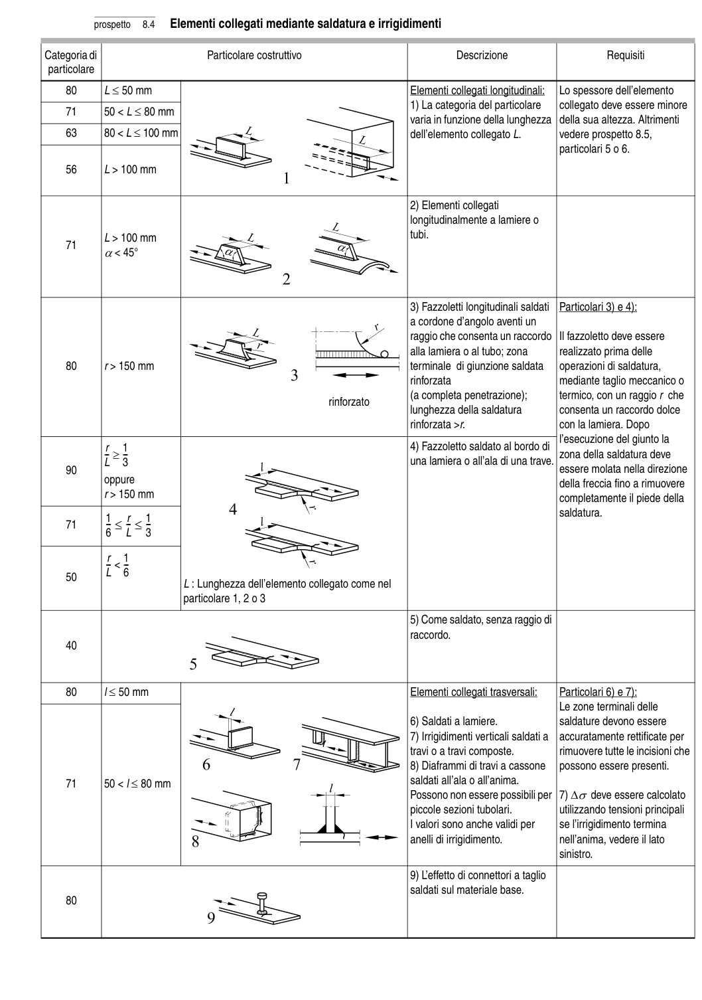

# 8 — Catalogo dei particolari costruttivi — pagina PDF 29

Fonte: [UNI EN 1993-1-9:2005 — Fatica](../../sources/ec3.pdf#page=29). Pagina stampata: 24.

> Formule, simboli e associazioni delle tabelle non sono convalidati per il calcolo.

## Testo estratto

prospetto   8.4   Elementi collegati mediante saldatura e irrigidimenti

Categoria di                          Particolare costruttivo                                 Descrizione                        Requisiti particolare

```text
    80     L ≤ 50 mm                                                      Elementi collegati longitudinali:   Lo spessore dell’elemento
                                                                                    1) La categoria del particolare    collegato deve essere minore
    71     50 < L ≤ 80 mm
                                                                                      varia in funzione della lunghezza  della sua altezza. Altrimenti
    63     80 < L ≤ 100 mm                                                    dell’elemento collegato L.        vedere prospetto 8.5,
                                                                                                                                   particolari 5 o 6.
```

56     L > 100 mm

```text
                                                                                    2) Elementi collegati
                                                                                 longitudinalmente a lamiere o
           L > 100 mm                                                                    tubi.
    71
     α< 45°
```

```text
                                                                                    3) Fazzoletti longitudinali saldati   Particolari 3) e 4):
                                                                   a cordone d’angolo aventi un
                                                                                raggio che consenta un raccordo   Il fazzoletto deve essere
                                                                                                alla lamiera o al tubo; zona       realizzato prima delle
    80        r > 150 mm                                                         terminale di giunzione saldata   operazioni di saldatura,
                                                                                         rinforzata                     mediante taglio meccanico o
                                                                                    (a completa penetrazione);       termico, con un raggio r che
                                                                     rinforzato
                                                                         lunghezza della saldatura       consenta un raccordo dolce
                                                                                         rinforzata >r.                  con la lamiera. Dopo
                                                                                                                  l’esecuzione del giunto la
                  r   1                                                                 4) Fazzoletto saldato al bordo di
                                 L-- ≥  3--                                                    una lamiera o all’ala di una trave. zona della saldatura deve
    90                                                                                                  essere molata nella direzione
            oppure                                                                                                      della freccia fino a rimuovere
                  r > 150 mm                                                                              completamente il piede della
                                                                                                                       saldatura.           1     r   1
    71                6-- ≤  L-- ≤  3--
```

```text
                   r  1
                                 L-- <  6--    50
                         L : Lunghezza dell’elemento collegato come nel
                                 particolare 1, 2 o 3
```

```text
                                                                                    5) Come saldato, senza raggio di
                                                                                 raccordo.
    40
```

```text
    80            l ≤ 50 mm                                                       Elementi collegati trasversali:     Particolari 6) e 7):
                                                                                              Le zone terminali delle
                                                                                    6) Saldati a lamiere.              saldature devono essere
                                                                                    7) Irrigidimenti verticali saldati a  accuratamente rettificate per
                                                                                                    travi o a travi composte.         rimuovere tutte le incisioni che
                                                                                    8) Diaframmi di travi a cassone   possono essere presenti.
    71     50 < l ≤ 80 mm                                                           saldati all’ala o all’anima.
                                                                    Possono non essere possibili per  7) ∆σ deve essere calcolato
                                                                                   piccole sezioni tubolari.           utilizzando tensioni principali
                                                                                                                                     I valori sono anche validi per     se l’irrigidimento termina
                                                                                               anelli di irrigidimento.             nell’anima, vedere il lato
                                                                                                                                          sinistro.
```

9) L’effetto di connettori a taglio saldati sul materiale base. 80

## Tabelle e dettagli

- [ec3-029-t01-d01](../details/ec3-029-t01-d01.md) — 40
- [ec3-029-t01-d02](../details/ec3-029-t01-d02.md) — 80
- [ec3-029-t01-d03](../details/ec3-029-t01-d03.md) — 80; 71; 63; 56
- [ec3-029-t01-d04](../details/ec3-029-t01-d04.md) — 71
- [ec3-029-t01-d05](../details/ec3-029-t01-d05.md) — 80
- [ec3-029-t01-d06](../details/ec3-029-t01-d06.md) — 90; 71; 50
- [ec3-029-t01-d07-01](../details/ec3-029-t01-d07-01.md) — 80; 71
- [ec3-029-t01-d07-02](../details/ec3-029-t01-d07-02.md) — 80; 71
- [ec3-029-t01-d07-03](../details/ec3-029-t01-d07-03.md) — 80; 71

## Pagina di riscontro


