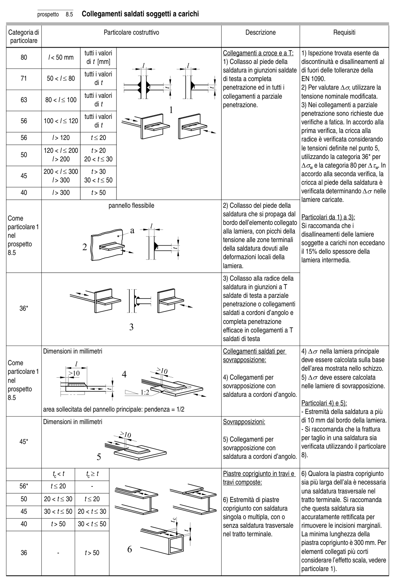

# 8 — Catalogo dei particolari costruttivi — pagina PDF 30

Fonte: [UNI EN 1993-1-9:2005 — Fatica](../../sources/ec3.pdf#page=30). Pagina stampata: 25.

> Formule, simboli e associazioni delle tabelle non sono convalidati per il calcolo.

## Testo estratto

prospetto   8.5   Collegamenti saldati soggetti a carichi

Categoria di                          Particolare costruttivo                               Descrizione                       Requisiti particolare

```text
                                         tutti i valori                                       Collegamenti a croce e a T:   1) Ispezione trovata esente da
    80                l < 50 mm
                                   di t [mm]                                            1) Collasso al piede della      discontinuità e disallineamenti al
                                                                                  saldatura in giunzioni saldate  di fuori delle tolleranze della
                                         tutti i valori
    71      50 < l ≤ 80                                                                  di testa a completa       EN 1090.
                                       di t
                                                                             penetrazione ed in tutti i       2) Per valutare ∆σ, utilizzare la
                                         tutti i valori                                         collegamenti a parziale       tensione nominale modificata.
    63      80 < l ≤ 100
                                       di t                                             penetrazione.                 3) Nei collegamenti a parziale
                                                                                                         penetrazione sono richieste due                                         tutti i valori
    56     100 < l ≤ 120                                                                                              verifiche a fatica. In accordo alla                                       di t
                                                                                                     prima verifica, la cricca alla
    56                    l > 120             t ≤ 20                                                                           radice è verificata considerando
           120 < l ≤ 200        t > 20                                                                                       le tensioni definite nel punto 5,
    50                                   l > 200     20 < t ≤ 30                                                                            utilizzando la categoria 36* per
                                                                              ∆σw e la categoria 80 per ∆τw. In
           200 < l ≤ 300        t > 30                                                                   accordo alla seconda verifica, la    45
                                   l > 300     30 < t ≤ 50                                                                           cricca al piede della saldatura è
    40                    l > 300             t > 50                                                                                     verificata determinando ∆σ nelle
                                                                                                             lamiere caricate.
                                     pannello flessibile                           2) Collasso del piede della
                                                                                  saldatura che si propaga dal
Come                                                                                                                       Particolari da 1) a 3):
                                                                         bordo dell’elemento collegato
particolare 1                                                                                                      Si raccomanda che i
                                                                                                alla lamiera, con picchi della
nel                                                                                                                disallineamenti delle lamiere
                                                                               tensione alle zone terminali
prospetto                                                                                                 soggette a carichi non eccedano
                                                                                        della saldatura dovuti alle
8.5                                                                                                                                                                                                                                il 15% dello spessore della
                                                                              deformazioni locali della                                                                                                             lamiera intermedia.
                                                                                    lamiera.
```

3) Collasso alla radice della saldatura in giunzioni a T saldate di testa a parziale penetrazione o collegamenti 36* saldati a cordoni d’angolo e completa penetrazione efficace in collegamenti a T saldati di testa

```text
            Dimensioni in millimetri                                           Collegamenti saldati per      4) ∆σ nella lamiera principale
                                                                                sovrapposizione:            deve essere calcolata sulla baseCome
                                                                                                                         dell’area mostrata nello schizzo.particolare 1
                                                                                    4) Collegamenti per           5) ∆σ deve essere calcolatanel
                                                                              sovrapposizione con           nelle lamiere di sovrapposizione.prospetto
                                                                                  saldatura a cordoni d’angolo.8.5
                                                                                                                             Particolari 4) e 5):
            area sollecitata del pannello principale: pendenza = 1/2                                                             - Estremità della saldatura a più
            Dimensioni in millimetri                                              Sovrapposizioni:                di 10 mm dal bordo della lamiera.
                                                                                                                                                        - Si raccomanda che la frattura
                                                                                    5) Collegamenti per          per taglio in una saldatura sia    45*
                                                                              sovrapposizione con           verificata utilizzando il particolare
                                                                                  saldatura a cordoni d’angolo.  8).
```

```text
                         tc < t            tc ≥ t                                                 Piastre coprigiunto in travi e   6) Qualora la piastra coprigiunto
                                                                                                    travi composte:                sia più larga dell’ala è necessaria
    56*              t ≤ 20             -
                                                                                            una saldatura trasversale nel
    50     20 < t ≤ 30       t ≤ 20                                                6) Estremità di piastre          tratto terminale. Si raccomanda
                                                                                   coprigiunto con saldatura    che questa saldatura sia    45     30 < t ≤ 50  20 < t ≤ 30
                                                                                  singola o multipla, con o      accuratamente rettificata per
    40               t > 50    30 < t ≤ 50                                      senza saldatura trasversale   rimuovere le incisioni marginali.
                                                                                    nel tratto terminale.         La minima lunghezza della
                                                                                                                       piastra coprigiunto è 300 mm. Per
    36                -                t > 50                                                                          elementi collegati più corti
                                                                                                           considerare l’effetto scala, vedere
                                                                                                                       particolare 1).
```

## Tabelle e dettagli

- [ec3-030-t01-d01](../details/ec3-030-t01-d01.md) — Come; particolare 1; nel; prospetto; 8.5
- [ec3-030-t01-d02](../details/ec3-030-t01-d02.md) — 36*
- [ec3-030-t01-d03](../details/ec3-030-t01-d03.md) — Come; particolare 1; nel; prospetto; 8.5
- [ec3-030-t01-d04](../details/ec3-030-t01-d04.md) — 45*

## Pagina di riscontro


