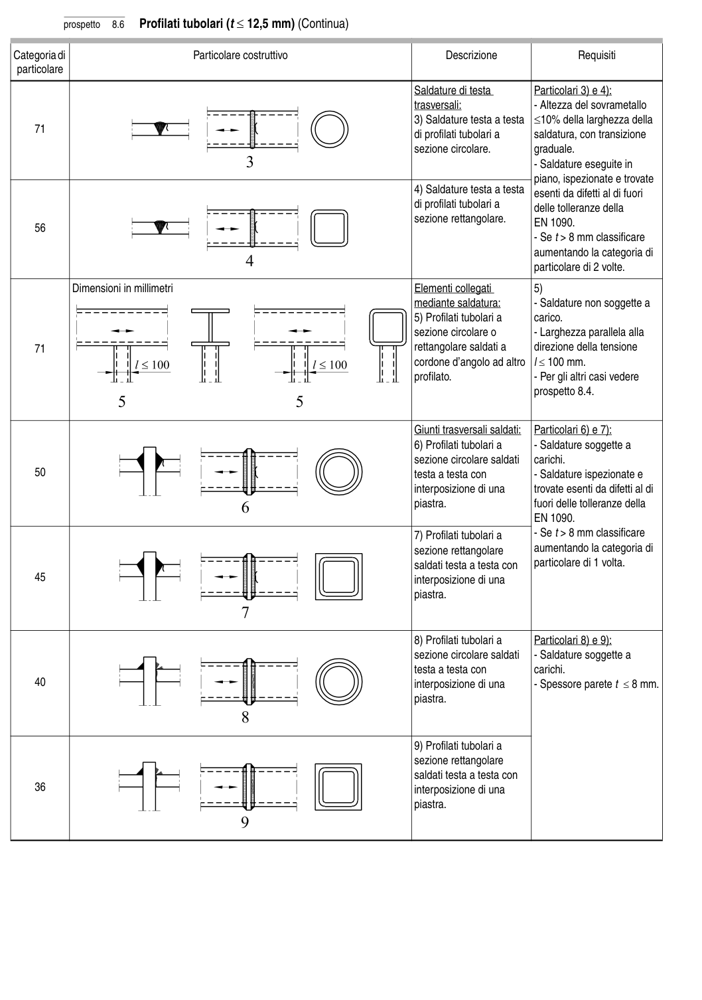

# 8 — Catalogo dei particolari costruttivi — pagina PDF 32

Fonte: [UNI EN 1993-1-9:2005 — Fatica](../../sources/ec3.pdf#page=32). Pagina stampata: 27.

> Formule, simboli e associazioni delle tabelle non sono convalidati per il calcolo.

## Testo estratto

prospetto   8.6   Profilati tubolari (t ≤ 12,5 mm) (Continua)

Categoria di                              Particolare costruttivo                                  Descrizione                   Requisiti particolare

```text
                                                                                     Saldature di testa           Particolari 3) e 4):
                                                                                                      trasversali:                      - Altezza del sovrametallo
                                                                                            3) Saldature testa a testa ≤10% della larghezza della
    71                                                                                                         di profilati tubolari a        saldatura, con transizione
                                                                                   sezione circolare.          graduale.
                                                                                                                                                               - Saldature eseguite in
                                                                                                                      piano, ispezionate e trovate
                                                                                            4) Saldature testa a testa  esenti da difetti al di fuori
                                                                                                         di profilati tubolari a        delle tolleranze della
                                                                                   sezione rettangolare.    EN 1090.    56
                                                                                                                                                               - Se t > 8 mm classificare
                                                                                               aumentando la categoria di
                                                                                                                           particolare di 2 volte.
```

```text
            Dimensioni in millimetri                                                  Elementi collegati          5)
                                                                               mediante saldatura:          - Saldature non soggette a
                                                                                            5) Profilati tubolari a        carico.
                                                                                   sezione circolare o           - Larghezza parallela alla
    71                                                                                    rettangolare saldati a      direzione della tensione
                                                                               cordone d’angolo ad altro    l ≤ 100 mm.
                                                                                                           profilato.                         - Per gli altri casi vedere
                                                                                                                  prospetto 8.4.
```

```text
                                                                                              Giunti trasversali saldati:   Particolari 6) e 7):
                                                                                            6) Profilati tubolari a          - Saldature soggette a
                                                                                   sezione circolare saldati    carichi.
    50                                                                                      testa a testa con              - Saldature ispezionate e
                                                                                            interposizione di una       trovate esenti da difetti al di
                                                                                                   piastra.                       fuori delle tolleranze della
                                                                            EN 1090.
                                                                                            7) Profilati tubolari a          - Se t > 8 mm classificare
                                                                                   sezione rettangolare      aumentando la categoria di
                                                                                                  saldati testa a testa con    particolare di 1 volta.
    45                                                                                     interposizione di una
                                                                                                   piastra.
```

```text
                                                                                            8) Profilati tubolari a        Particolari 8) e 9):
                                                                                   sezione circolare saldati    - Saldature soggette a
                                                                                              testa a testa con            carichi.
    40                                                                                     interposizione di una         - Spessore parete t ≤ 8 mm.
                                                                                                   piastra.
```

```text
                                                                                            9) Profilati tubolari a
                                                                                   sezione rettangolare
                                                                                                  saldati testa a testa con
    36                                                                                     interposizione di una
                                                                                                   piastra.
```

## Tabelle e dettagli

- [ec3-032-t01-d01](../details/ec3-032-t01-d01.md) — 71
- [ec3-032-t01-d02](../details/ec3-032-t01-d02.md) — 56
- [ec3-032-t01-d03](../details/ec3-032-t01-d03.md) — 71
- [ec3-032-t01-d04](../details/ec3-032-t01-d04.md) — 50
- [ec3-032-t01-d05](../details/ec3-032-t01-d05.md) — 45
- [ec3-032-t01-d06](../details/ec3-032-t01-d06.md) — 40
- [ec3-032-t01-d07](../details/ec3-032-t01-d07.md) — 36

## Pagina di riscontro


