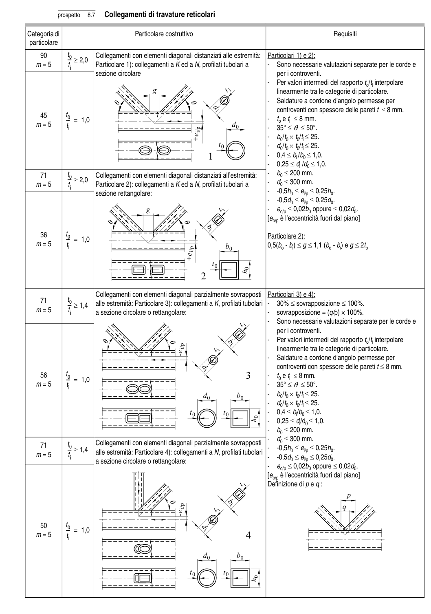

# 8 — Catalogo dei particolari costruttivi — pagina PDF 33

Fonte: [UNI EN 1993-1-9:2005 — Fatica](../../sources/ec3.pdf#page=33). Pagina stampata: 28.

> Formule, simboli e associazioni delle tabelle non sono convalidati per il calcolo.

## Testo estratto

prospetto   8.7   Collegamenti di travature reticolari

Categoria di                             Particolare costruttivo                                                       Requisiti particolare

```text
    90         t0        Collegamenti con elementi diagonali distanziati alle estremità:   Particolari 1) e 2):
                              --- ≥ 2,0
  m = 5          ti         Particolare 1): collegamenti a K ed a N, profilati tubolari a         -  Sono necessarie valutazioni separate per le corde e
                       sezione circolare                                               per i controventi.
                                                                                                                       -  Per valori intermedi del rapporto to/ti interpolare
                                                                                      linearmente tra le categorie di particolare.
                                                                                                                       -   Saldature a cordone d’angolo permesse per
                                                                                             controventi con spessore delle pareti t ≤ 8 mm.
    45         t0                             --- = 1,0                                                                                        -    to e ti ≤ 8 mm.
  m = 5         ti                                                                                                  -  35° ≤θ ≤ 50°.
                                                                                                                       -   b0/t0 × t0/ti ≤ 25.
                                                                                                                       -   d0/t0 × t0/ti ≤ 25.
                                                                                                                       -   0,4 ≤bi /b0 ≤ 1,0.
                                                                                                                       -  0,25 ≤di /d0 ≤ 1,0.
    71         t0        Collegamenti con elementi diagonali distanziati all’estremità:     -   b0 ≤ 200 mm.
                              ---           ≥ 2,0                                                                                                                       -   d0 ≤ 300 mm.  m = 5                          Particolare 2): collegamenti a K ed a N, profilati tubolari a                         ti
                                                                                                                       -   -0,5h0 ≤ei/p ≤ 0,25h0.                       sezione rettangolare:
                                                                                                                       -   -0,5d0 ≤ei/p ≤ 0,25d0.
                                                                                                                       -   eo/p ≤ 0,02b0 oppure ≤ 0,02d0.
                                                                                                             [eo/p è l’eccentricità fuori dal piano]
```

36         t0                                                                           Particolare 2):                             --- = 1,0 m = 5         ti                                                                          0,5(bo - bi) ≤g ≤ 1,1 (bo - bi) e g ≤ 2to

```text
                       Collegamenti con elementi diagonali parzialmente sovrapposti  Particolari 3) e 4):
    71         t0                              --- ≥ 1,4   alle estremità: Particolare 3): collegamenti a K, profilati tubolari  -  30% ≤ sovrapposizione ≤ 100%.
  m = 5          ti       a sezione circolare o rettangolare:                                        -   sovrapposizione = (q/p) × 100%.
                                                                                                                       -  Sono necessarie valutazioni separate per le corde e
                                                                                      per i controventi.
                                                                                                                       -  Per valori intermedi del rapporto to/ti interpolare
                                                                                      linearmente tra le categorie di particolare.
                                                                                                                       -   Saldature a cordone d’angolo permesse per
                                                                                             controventi con spessore delle pareti t ≤ 8 mm.
    56         t0                                                                                                  -    t0 e ti ≤ 8 mm.                             --- = 1,0
  m = 5         ti                                                                                                  -  35° ≤θ ≤ 50°.
                                                                                                                       -   b0/t0 × t0/ti ≤ 25.
                                                                                                                       -   d0/t0 × t0/ti ≤ 25.
                                                                                                                       -   0,4 ≤bi/b0 ≤ 1,0.
                                                                                                                       -  0,25 ≤di/d0 ≤ 1,0.
                                                                                                                       -   b0 ≤ 200 mm.
                                                                                                                       -   d0 ≤ 300 mm.                       Collegamenti                                con                                         elementi                                                     diagonali                                                          parzialmente                                                                         sovrapposti    71                  t0                                                                                                                       -                                                                      ≤                                                                                             -0,5h0 ≤ei/p                                                                                                         0,25h0.                              ---           ≥ 1,4                             alle estremità:                                         Particolare                                                           4):                                                    collegamenti                                                      a N, profilati                                                                                      tubolari  m    = 5                         ti                                                                                                                       -                                                                      ≤                                                                                             -0,5d0                                                                                                  ≤ei/p                                                                                                         0,25d0.                    a sezione circolare o rettangolare:
                                                                                                                       -   eo/p ≤ 0,02b0 oppure ≤ 0,02d0.
                                                                                                             [eo/p è l’eccentricità fuori dal piano]
                                                                                        Definizione di p e q :
```

```text
    50         t0
                             --- = 1,0
  m = 5         ti
```

## Tabelle e dettagli

- [ec3-033-t01-d01](../details/ec3-033-t01-d01.md) — 90; m = 5; 45; m = 5
- [ec3-033-t01-d02](../details/ec3-033-t01-d02.md) — 71; m = 5; 36; m = 5
- [ec3-033-t01-d03](../details/ec3-033-t01-d03.md) — 71; m = 5; 56; m = 5
- [ec3-033-t01-d04](../details/ec3-033-t01-d04.md) — 71; m = 5; 50; m = 5

## Pagina di riscontro


