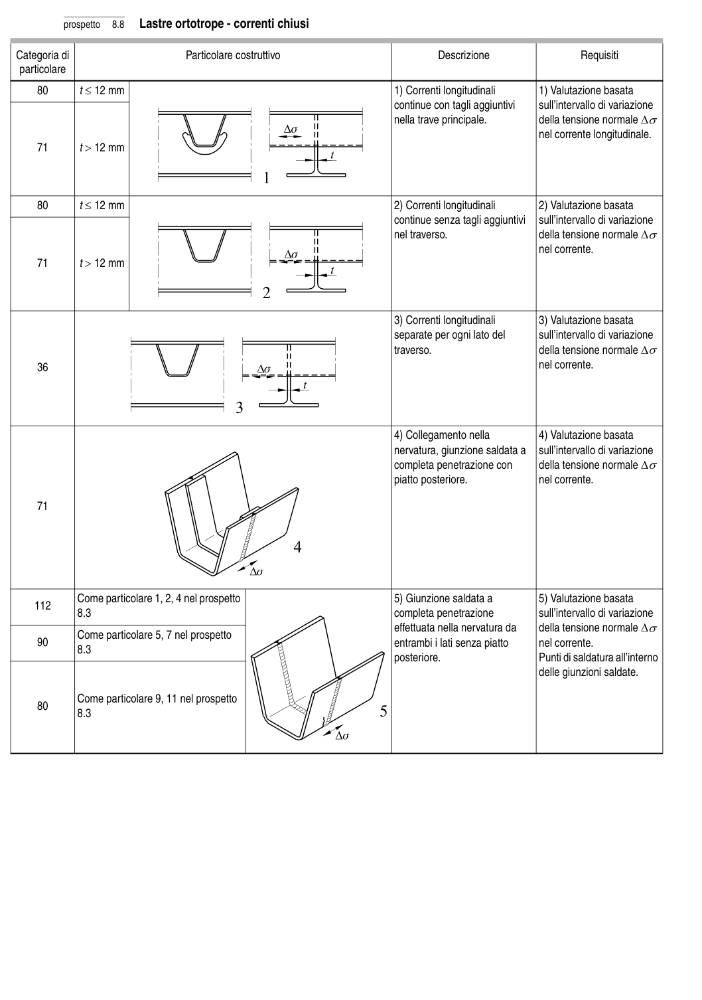

# 8 — Catalogo dei particolari costruttivi — pagina PDF 34

Fonte: [UNI EN 1993-1-9:2005 — Fatica](../../sources/ec3.pdf#page=34). Pagina stampata: 29.

> Formule, simboli e associazioni delle tabelle non sono convalidati per il calcolo.

## Testo estratto

prospetto   8.8   Lastre ortotrope - correnti chiusi

Categoria di                           Particolare costruttivo                                  Descrizione                      Requisiti particolare

```text
    80           t ≤ 12 mm                                                             1) Correnti longitudinali          1) Valutazione basata
                                                                                 continue con tagli aggiuntivi      sull’intervallo di variazione
                                                                                           nella trave principale.             della tensione normale ∆σ
                                                                                                                       nel corrente longitudinale.
    71           t > 12 mm
```

```text
    80           t ≤ 12 mm                                                             2) Correnti longitudinali          2) Valutazione basata
                                                                                 continue senza tagli aggiuntivi    sull’intervallo di variazione
                                                                                      nel traverso.                      della tensione normale ∆σ
                                                                                                                       nel corrente.
    71           t > 12 mm
```

```text
                                                                                      3) Correnti longitudinali          3) Valutazione basata
                                                                               separate per ogni lato del         sull’intervallo di variazione
                                                                                           traverso.                          della tensione normale ∆σ
    36                                                                                                                nel corrente.
```

```text
                                                                                      4) Collegamento nella           4) Valutazione basata
                                                                                     nervatura, giunzione saldata a   sull’intervallo di variazione
                                                                            completa penetrazione con      della tensione normale ∆σ
                                                                                              piatto posteriore.                nel corrente.
```

71

```text
         Come particolare 1, 2, 4 nel prospetto                                   5) Giunzione saldata a          5) Valutazione basata
   112
             8.3                                                             completa penetrazione            sull’intervallo di variazione
                                                                                             effettuata nella nervatura da     della tensione normale ∆σ
         Come particolare 5, 7 nel prospetto
    90                                                                        entrambi i lati senza piatto       nel corrente.
             8.3
                                                                                         posteriore.                      Punti di saldatura all’interno
                                                                                                                              delle giunzioni saldate.
```

```text
         Come particolare 9, 11 nel prospetto
    80
             8.3
```

## Tabelle e dettagli

- [ec3-034-t01-d01](../details/ec3-034-t01-d01.md) — 36
- [ec3-034-t01-d02](../details/ec3-034-t01-d02.md) — 71
- [ec3-034-t01-d03](../details/ec3-034-t01-d03.md) — 112; 90; 80
- [ec3-034-t01-d04](../details/ec3-034-t01-d04.md) — 80; 71
- [ec3-034-t01-d05](../details/ec3-034-t01-d05.md) — 80; 71

## Pagina di riscontro


