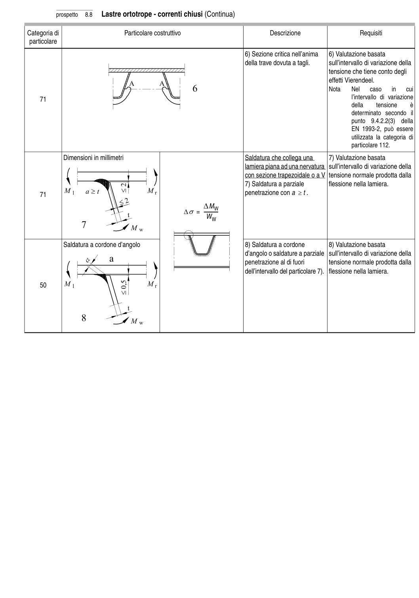

# 8 — Catalogo dei particolari costruttivi — pagina PDF 35

Fonte: [UNI EN 1993-1-9:2005 — Fatica](../../sources/ec3.pdf#page=35). Pagina stampata: 30.

> Formule, simboli e associazioni delle tabelle non sono convalidati per il calcolo.

## Testo estratto

prospetto   8.8   Lastre ortotrope - correnti chiusi (Continua)

Categoria di                          Particolare costruttivo                                Descrizione                        Requisiti particolare

```text
                                                                                   6) Sezione critica nell’anima    6) Valutazione basata
                                                                                        della trave dovuta a tagli.        sull’intervallo di variazione della
                                                                                                             tensione che tiene conto degli
                                                                                                                                                     effetti Vierendeel.
                                                                                                       Nota    Nel   caso     in    cui
    71                                                                                                                                                    l’intervallo  di variazione
                                                                                                                                          della     tensione    è
                                                                                                                         determinato secondo    il
                                                                                                                     punto  9.4.2.2(3)   della
                                                                                   EN 1993-2, può essere
                                                                                                                                                      utilizzata la categoria di
                                                                                                                                        particolare 112.
```

```text
            Dimensioni in millimetri                                            Saldatura che collega una      7) Valutazione basata
                                                                               lamiera piana ad una nervatura  sull’intervallo di variazione della
                                                                     con sezione trapezoidale o a V tensione normale prodotta dalla
                                                                                   7) Saldatura a parziale          flessione nella lamiera.
    71                                                                      penetrazione con a ≥ t .
                                    ∆MW
                            ∆σ =    --------------
                                   WW
```

```text
             Saldatura a cordone d’angolo                                        8) Saldatura a cordone         8) Valutazione basata
                                                                              d’angolo o saldature a parziale  sull’intervallo di variazione della
                                                                             penetrazione al di fuori         tensione normale prodotta dalla
                                                                                                  dell’intervallo del particolare 7).  flessione nella lamiera.
```

50

## Tabelle e dettagli

- [ec3-035-t01-d01](../details/ec3-035-t01-d01.md) — 71
- [ec3-035-t01-d02-01](../details/ec3-035-t01-d02-01.md) — D; ; ; ; ; 71; S; ; ; ; ; ; 50
- [ec3-035-t01-d02-02](../details/ec3-035-t01-d02-02.md) — D; ; ; ; ; 71; S; ; ; ; ; ; 50

## Pagina di riscontro


