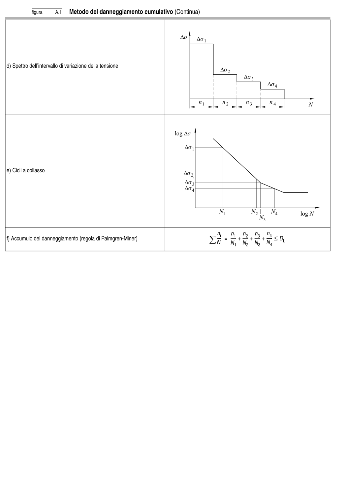

# Appendice A — Carico di fatica e verifiche — pagina PDF 40

Fonte: [UNI EN 1993-1-9:2005 — Fatica](../../sources/ec3.pdf#page=40). Pagina stampata: 35.

> Formule, simboli e associazioni delle tabelle non sono convalidati per il calcolo.

## Testo estratto

figura      A.1  Metodo del danneggiamento cumulativo (Continua)

d) Spettro dell’intervallo di variazione della tensione

e) Cicli a collasso

ni    n1   n2   n3   n4 f) Accumulo del danneggiamento (regola di Palmgren-Miner)           ∑ ----Ni =   ------N1 +  ------N2 +  ------N3 +  ------N4 ≤ DL

## Pagina di riscontro

