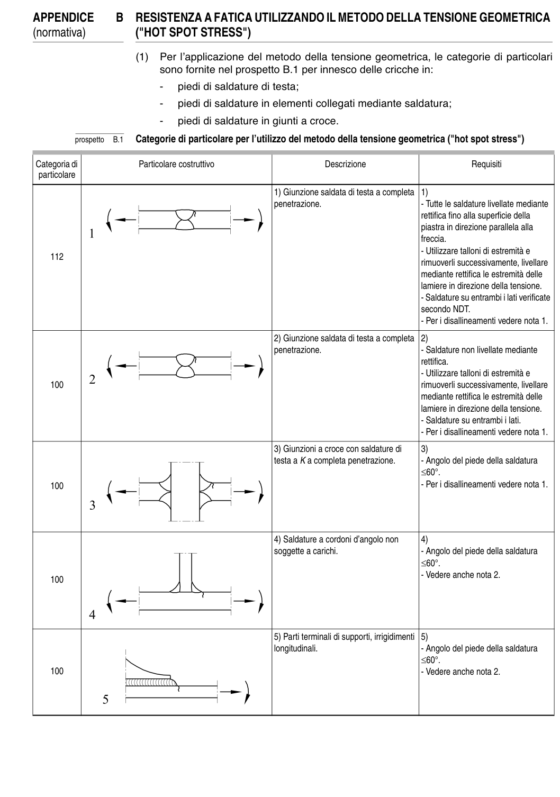

# Appendice B — Tensione geometrica hot spot — pagina PDF 41

Fonte: [UNI EN 1993-1-9:2005 — Fatica](../../sources/ec3.pdf#page=41). Pagina stampata: 36.

> Formule, simboli e associazioni delle tabelle non sono convalidati per il calcolo.

## Testo estratto

APPENDICE   B  RESISTENZA A FATICA UTILIZZANDO IL METODO DELLA TENSIONE GEOMETRICA (normativa)        ("HOT SPOT STRESS")

(1)  Per l’applicazione del metodo della tensione geometrica, le categorie di particolari sono fornite nel prospetto B.1 per innesco delle cricche in:

-   piedi di saldature di testa;

-   piedi di saldature in elementi collegati mediante saldatura;

-   piedi di saldature in giunti a croce.

prospetto   B.1   Categorie di particolare per l’utilizzo del metodo della tensione geometrica ("hot spot stress")

Categoria di                  Particolare costruttivo                              Descrizione                                Requisiti particolare

```text
                                                                     1) Giunzione saldata di testa a completa  1)
                                                                  penetrazione.                                      - Tutte le saldature livellate mediante
                                                                                                                                          rettifica fino alla superficie della
                                                                                                                   piastra in direzione parallela alla
                                                                                                                           freccia.
                                                                                                                                                    - Utilizzare talloni di estremità e
    112
                                                                                                                  rimuoverli successivamente, livellare
                                                                                                mediante rettifica le estremità delle
                                                                                                         lamiere in direzione della tensione.
                                                                                                                                                    - Saldature su entrambi i lati verificate
                                                                                           secondo NDT.
                                                                                                                                                    - Per i disallineamenti vedere nota 1.
```

```text
                                                                     2) Giunzione saldata di testa a completa  2)
                                                                  penetrazione.                                      - Saldature non livellate mediante
                                                                                                                                             rettifica.
                                                                                                                                                    - Utilizzare talloni di estremità e
    100                                                                                                         rimuoverli successivamente, livellare
                                                                                                mediante rettifica le estremità delle
                                                                                                         lamiere in direzione della tensione.
                                                                                                                                                    - Saldature su entrambi i lati.
                                                                                                                                                    - Per i disallineamenti vedere nota 1.
```

```text
                                                                     3) Giunzioni a croce con saldature di      3)
                                                                       testa a K a completa penetrazione.          - Angolo del piede della saldatura
                                                                                                     ≤60°.
    100                                                                                                                                        - Per i disallineamenti vedere nota 1.
```

```text
                                                                     4) Saldature a cordoni d’angolo non      4)
                                                                soggette a carichi.                                - Angolo del piede della saldatura
                                                                                                     ≤60°.
                                                                                                                                                    - Vedere anche nota 2.
    100
```

```text
                                                                     5) Parti terminali di supporti, irrigidimenti  5)
                                                                             longitudinali.                                       - Angolo del piede della saldatura
                                                                                                     ≤60°.
    100                                                                                                                                        - Vedere anche nota 2.
```

## Tabelle e dettagli

- [ec3-041-t01-d01](../details/ec3-041-t01-d01.md) — 112
- [ec3-041-t01-d02](../details/ec3-041-t01-d02.md) — 100
- [ec3-041-t01-d03](../details/ec3-041-t01-d03.md) — 100
- [ec3-041-t01-d04](../details/ec3-041-t01-d04.md) — 100
- [ec3-041-t01-d05](../details/ec3-041-t01-d05.md) — 100

## Pagina di riscontro


