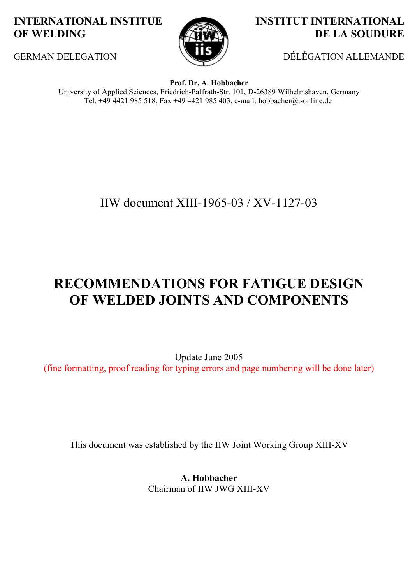

# Copertina, prefazione e indice — pagina PDF 1

Fonte: [IIW — Recommendations for Fatigue Design of Welded Joints and Components](../../sources/iiw.pdf#page=1). Pagina stampata: 1.

> Formule, simboli e associazioni delle tabelle non sono convalidati per il calcolo.

## Testo estratto

INTERNATIONAL INSTITUE              INSTITUT INTERNATIONAL OF WELDING                              DE LA SOUDURE

GERMAN DELEGATION                            DÉLÉGATION ALLEMANDE

Prof. Dr. A. Hobbacher University of Applied Sciences, Friedrich-Paffrath-Str. 101, D-26389 Wilhelmshaven, Germany Tel. +49 4421 985 518, Fax +49 4421 985 403, e-mail: hobbacher@t-online.de

IIW document XIII-1965-03 / XV-1127-03

RECOMMENDATIONS FOR FATIGUE DESIGN OF WELDED JOINTS AND COMPONENTS

Update June 2005 (fine formatting, proof reading for typing errors and page numbering will be done later)

This document was established by the IIW Joint Working Group XIII-XV

A. Hobbacher Chairman of IIW JWG XIII-XV

## Pagina di riscontro

