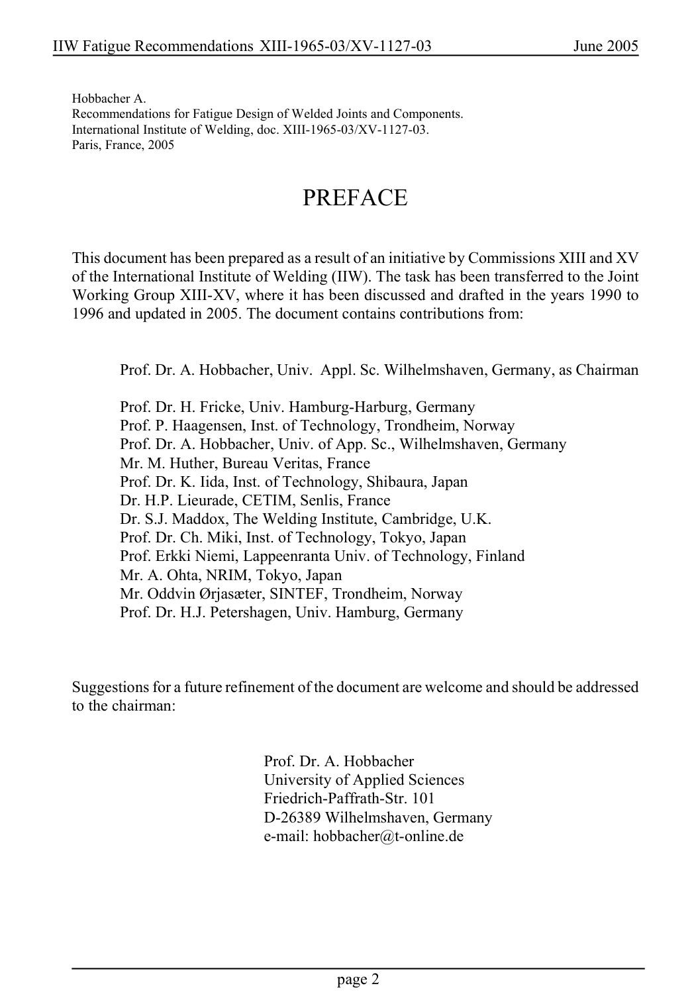

# Copertina, prefazione e indice — pagina PDF 2

Fonte: [IIW — Recommendations for Fatigue Design of Welded Joints and Components](../../sources/iiw.pdf#page=2). Pagina stampata: 2.

> Formule, simboli e associazioni delle tabelle non sono convalidati per il calcolo.

## Testo estratto

IIW Fatigue Recommendations XIII-1965-03/XV-1127-03                   June 2005

Hobbacher A. Recommendations for Fatigue Design of Welded Joints and Components. International Institute of Welding, doc. XIII-1965-03/XV-1127-03. Paris, France, 2005

PREFACE

This document has been prepared as a result of an initiative by Commissions XIII and XV of the International Institute of Welding (IIW). The task has been transferred to the Joint Working Group XIII-XV, where it has been discussed and drafted in the years 1990 to 1996 and updated in 2005. The document contains contributions from:

Prof. Dr. A. Hobbacher, Univ. Appl. Sc. Wilhelmshaven, Germany, as Chairman

Prof. Dr. H. Fricke, Univ. Hamburg-Harburg, Germany Prof. P. Haagensen, Inst. of Technology, Trondheim, Norway Prof. Dr. A. Hobbacher, Univ. of App. Sc., Wilhelmshaven, Germany Mr. M. Huther, Bureau Veritas, France Prof. Dr. K. Iida, Inst. of Technology, Shibaura, Japan Dr. H.P. Lieurade, CETIM, Senlis, France Dr. S.J. Maddox, The Welding Institute, Cambridge, U.K. Prof. Dr. Ch. Miki, Inst. of Technology, Tokyo, Japan Prof. Erkki Niemi, Lappeenranta Univ. of Technology, Finland Mr. A. Ohta, NRIM, Tokyo, Japan Mr. Oddvin Ørjasæter, SINTEF, Trondheim, Norway Prof. Dr. H.J. Petershagen, Univ. Hamburg, Germany

Suggestions for a future refinement of the document are welcome and should be addressed to the chairman:

Prof. Dr. A. Hobbacher University of Applied Sciences Friedrich-Paffrath-Str. 101 D-26389 Wilhelmshaven, Germany e-mail: hobbacher@t-online.de

page 2

## Pagina di riscontro

