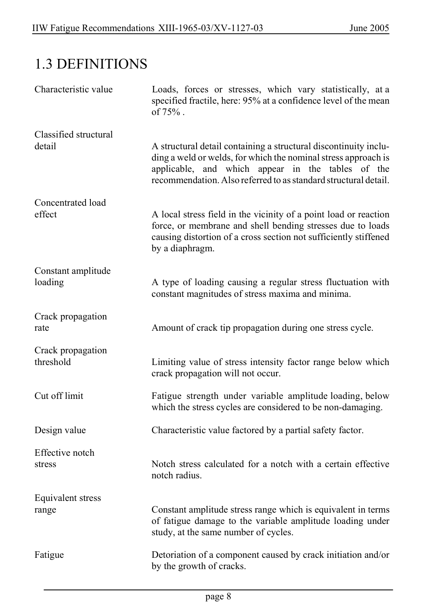

# 1 — General — pagina PDF 8

Fonte: [IIW — Recommendations for Fatigue Design of Welded Joints and Components](../../sources/iiw.pdf#page=8). Pagina stampata: 8.

> Formule, simboli e associazioni delle tabelle non sono convalidati per il calcolo.

## Testo estratto

IIW Fatigue Recommendations XIII-1965-03/XV-1127-03                   June 2005

1.3 DEFINITIONS

```text
 Characteristic value         Loads, forces or  stresses, which vary  statistically,  at a
                              specified fractile, here: 95% at a confidence level of the mean
                             of 75% .
```

```text
 Classified structural
 detail              A structural detail containing a structural discontinuity inclu-
                            ding a weld or welds, for which the nominal stress approach is
                               applicable,  and  which  appear  in  the  tables  of  the
                          recommendation. Also referred to as standard structural detail.
```

```text
 Concentrated load
 effect             A local stress field in the vicinity of a point load or reaction
                                force, or membrane and shell bending stresses due to loads
                            causing distortion of a cross section not sufficiently stiffened
                        by a diaphragm.
```

```text
 Constant amplitude
 loading            A type of loading causing a regular stress fluctuation with
                             constant magnitudes of stress maxima and minima.
```

Crack propagation rate                   Amount of crack tip propagation during one stress cycle.

```text
 Crack propagation
 threshold                   Limiting value of stress intensity factor range below which
                            crack propagation will not occur.
```

Cut off limit                Fatigue strength under variable amplitude loading, below which the stress cycles are considered to be non-damaging.

Design value                 Characteristic value factored by a partial safety factor.

```text
 Effective notch
 stress                    Notch stress calculated for a notch with a certain effective
                            notch radius.
```

```text
 Equivalent stress
 range                      Constant amplitude stress range which is equivalent in terms
                             of fatigue damage to the variable amplitude loading under
                              study, at the same number of cycles.
```

Fatigue                      Detoriation of a component caused by crack initiation and/or by the growth of cracks.

page 8

## Pagina di riscontro


