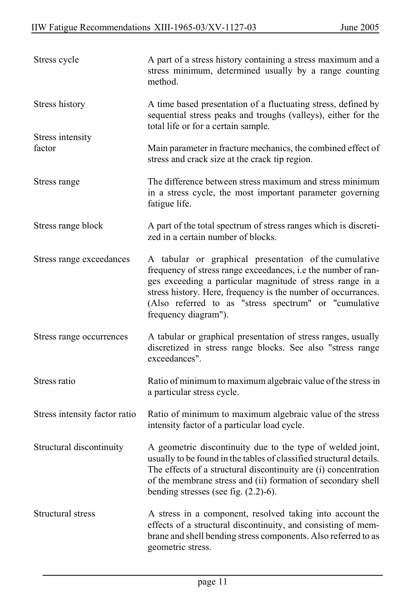

# 1 — General — pagina PDF 11

Fonte: [IIW — Recommendations for Fatigue Design of Welded Joints and Components](../../sources/iiw.pdf#page=11). Pagina stampata: 11.

> Formule, simboli e associazioni delle tabelle non sono convalidati per il calcolo.

## Testo estratto

IIW Fatigue Recommendations XIII-1965-03/XV-1127-03                   June 2005

```text
 Stress cycle          A part of a stress history containing a stress maximum and a
                                 stress minimum, determined usually by a range counting
                          method.
```

```text
 Stress history         A time based presentation of a fluctuating stress, defined by
                              sequential stress peaks and troughs (valleys), either for the
                                  total life or for a certain sample.
 Stress intensity
 factor                  Main parameter in fracture mechanics, the combined effect of
                                 stress and crack size at the crack tip region.
```

```text
 Stress range              The difference between stress maximum and stress minimum
                               in a stress cycle, the most important parameter governing
                               fatigue life.
```

Stress range block       A part of the total spectrum of stress ranges which is discreti- zed in a certain number of blocks.

```text
 Stress range exceedances   A  tabular  or  graphical  presentation  of the cumulative
                            frequency of stress range exceedances, i.e the number of ran-
                            ges exceeding a particular magnitude of stress range in a
                                 stress history. Here, frequency is the number of occurrances.
                           (Also  referred  to  as  "stress  spectrum"  or  "cumulative
                            frequency diagram").
```

```text
 Stress range occurrences   A tabular or graphical presentation of stress ranges, usually
                               discretized in stress range blocks. See also "stress range
                            exceedances".
```

Stress ratio                 Ratio of minimum to maximum algebraic value of the stress in a particular stress cycle.

Stress intensity factor ratio   Ratio of minimum to maximum algebraic value of the stress intensity factor of a particular load cycle.

```text
 Structural discontinuity    A geometric discontinuity due to the type of welded joint,
                              usually to be found in the tables of classified structural details.
                        The effects of a structural discontinuity are (i) concentration
                             of the membrane stress and (ii) formation of secondary shell
                           bending stresses (see fig. (2.2)-6).
```

```text
 Structural stress        A stress in a component, resolved taking into account the
                                effects of a structural discontinuity, and consisting of mem-
                            brane and shell bending stress components. Also referred to as
                            geometric stress.
```

page 11

## Pagina di riscontro


