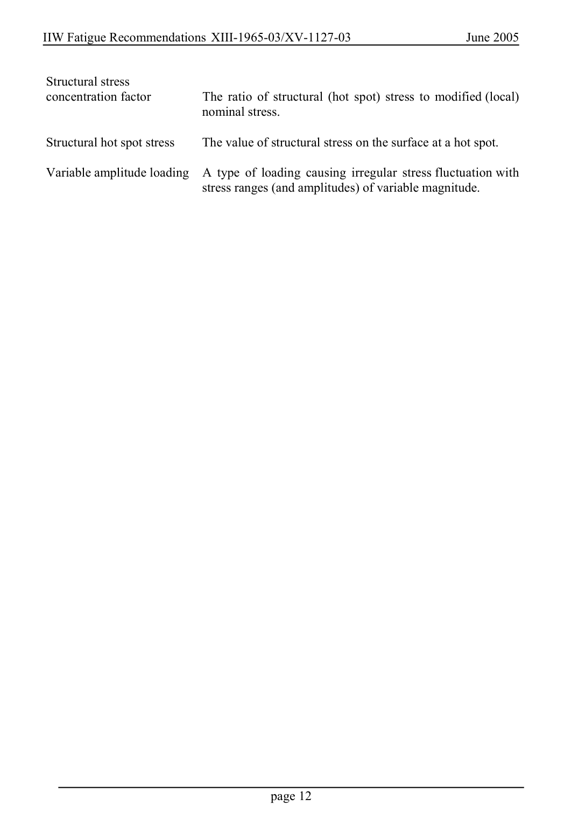

# 1 — General — pagina PDF 12

Fonte: [IIW — Recommendations for Fatigue Design of Welded Joints and Components](../../sources/iiw.pdf#page=12). Pagina stampata: 12.

> Formule, simboli e associazioni delle tabelle non sono convalidati per il calcolo.

## Testo estratto

IIW Fatigue Recommendations XIII-1965-03/XV-1127-03                   June 2005

```text
 Structural stress
 concentration factor        The ratio of structural (hot spot) stress to modified (local)
                          nominal stress.
```

Structural hot spot stress    The value of structural stress on the surface at a hot spot.

Variable amplitude loading A type of loading causing irregular stress fluctuation with stress ranges (and amplitudes) of variable magnitude.

page 12

## Pagina di riscontro


