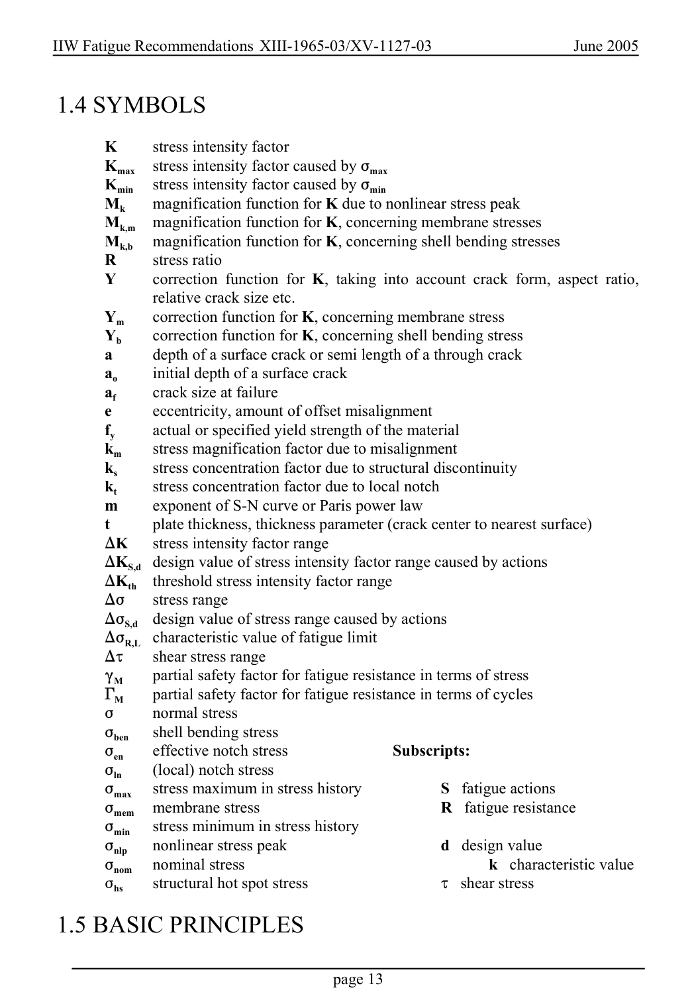

# 1 — General — pagina PDF 13

Fonte: [IIW — Recommendations for Fatigue Design of Welded Joints and Components](../../sources/iiw.pdf#page=13). Pagina stampata: 13.

> Formule, simboli e associazioni delle tabelle non sono convalidati per il calcolo.

## Testo estratto

IIW Fatigue Recommendations XIII-1965-03/XV-1127-03                   June 2005

1.4 SYMBOLS

```text
    K      stress intensity factor
       Kmax   stress intensity factor caused by Fmax
       Kmin   stress intensity factor caused by Fmin
     Mk    magnification function for K due to nonlinear stress peak
       Mk,m   magnification function for K, concerning membrane stresses
       Mk,b   magnification function for K, concerning shell bending stresses
    R      stress ratio
    Y      correction function for K, taking into account crack form, aspect ratio,
                 relative crack size etc.
     Ym    correction function for K, concerning membrane stress
      Yb     correction function for K, concerning shell bending stress
      a      depth of a surface crack or semi length of a through crack
        ao       initial depth of a surface crack
         af     crack size at failure
       e       eccentricity, amount of offset misalignment
          fy      actual or specified yield strength of the material
      km     stress magnification factor due to misalignment
        ks      stress concentration factor due to structural discontinuity
         kt      stress concentration factor due to local notch
    m     exponent of S-N curve or Paris power law
          t       plate thickness, thickness parameter (crack center to nearest surface)
    )K    stress intensity factor range
       )KS,d  design value of stress intensity factor range caused by actions
       )Kth  threshold stress intensity factor range
     )F     stress range
        )FS,d  design value of stress range caused by actions
       )FR,L  characteristic value of fatigue limit
      )J    shear stress range
      (M     partial safety factor for fatigue resistance in terms of stress
      'M     partial safety factor for fatigue resistance in terms of cycles
      F     normal stress
         Fben    shell bending stress
        Fen     effective notch stress               Subscripts:
         Fln     (local) notch stress
        Fmax    stress maximum in stress history         S  fatigue actions
       Fmem  membrane stress                R  fatigue resistance
        Fmin    stress minimum in stress history
         Fnlp    nonlinear stress peak                 d  design value
        Fnom   nominal stress                           k  characteristic value
         Fhs     structural hot spot stress                 J  shear stress
```

1.5 BASIC PRINCIPLES

page 13

## Pagina di riscontro


