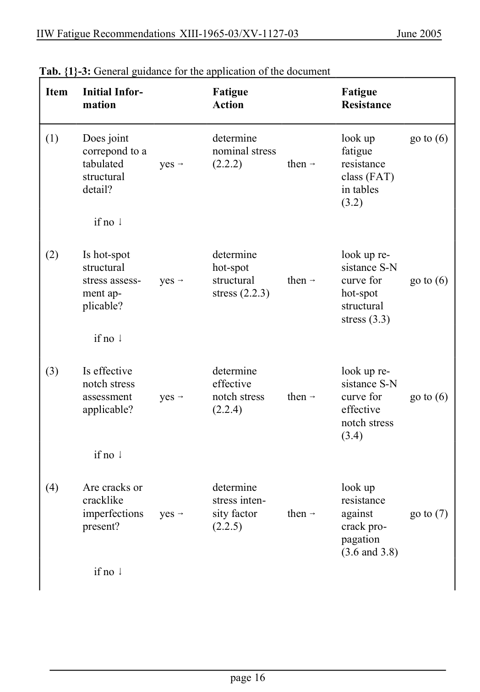

# 1 — General — pagina PDF 16

Fonte: [IIW — Recommendations for Fatigue Design of Welded Joints and Components](../../sources/iiw.pdf#page=16). Pagina stampata: 16.

> Formule, simboli e associazioni delle tabelle non sono convalidati per il calcolo.

## Testo estratto

IIW Fatigue Recommendations XIII-1965-03/XV-1127-03                   June 2005

Tab. {1}-3: General guidance for the application of the document

Item    Initial Infor-              Fatigue                  Fatigue mation                  Action                    Resistance

```text
  (1)    Does joint                 determine                 look up      go to (6)
         correpond to a             nominal stress               fatigue
          tabulated       yes 6       (2.2.2)          then 6      resistance
           structural                                                  class (FAT)
           detail?                                                     in tables
                                                                        (3.2)
```

if no 9

```text
  (2)      Is hot-spot                 determine                 look up re-
           structural                   hot-spot                     sistance S-N
           stress assess-    yes 6       structural       then 6     curve for     go to (6)
        ment ap-                      stress (2.2.3)                hot-spot
          plicable?                                                    structural
                                                                          stress (3.3)
```

if no 9

```text
  (3)      Is effective                determine                 look up re-
         notch stress                  effective                     sistance S-N
         assessment      yes 6      notch stress     then 6     curve for     go to (6)
          applicable?                   (2.2.4)                       effective
                                                              notch stress
                                                                        (3.4)
```

if no 9

```text
  (4)    Are cracks or              determine                 look up
          cracklike                      stress inten-                 resistance
          imperfections   yes 6       sity factor      then 6      against       go to (7)
          present?                      (2.2.5)                     crack pro-
                                                                pagation
                                                                      (3.6 and 3.8)
```

if no 9

page 16

## Pagina di riscontro


