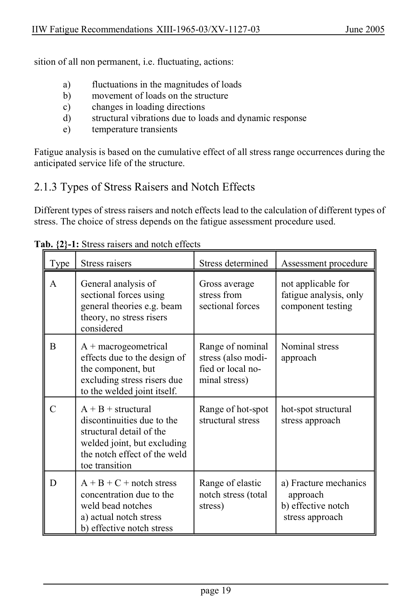

# 2 — Fatigue actions (loading) — pagina PDF 19

Fonte: [IIW — Recommendations for Fatigue Design of Welded Joints and Components](../../sources/iiw.pdf#page=19). Pagina stampata: 19.

> Formule, simboli e associazioni delle tabelle non sono convalidati per il calcolo.

## Testo estratto

IIW Fatigue Recommendations XIII-1965-03/XV-1127-03                   June 2005

sition of all non permanent, i.e. fluctuating, actions:

```text
        a)      fluctuations in the magnitudes of loads
        b)    movement of loads on the structure
        c)     changes in loading directions
        d)      structural vibrations due to loads and dynamic response
        e)     temperature transients
```

Fatigue analysis is based on the cumulative effect of all stress range occurrences during the anticipated service life of the structure.

2.1.3 Types of Stress Raisers and Notch Effects

Different types of stress raisers and notch effects lead to the calculation of different types of stress. The choice of stress depends on the fatigue assessment procedure used.

Tab. {2}-1: Stress raisers and notch effects

Type   Stress raisers                  Stress determined   Assessment procedure

```text
   A      General analysis of          Gross average       not applicable for
             sectional forces using          stress from          fatigue analysis, only
            general theories e.g. beam     sectional forces     component testing
             theory, no stress risers
            considered
```

```text
   B    A + macrogeometrical      Range of nominal   Nominal stress
             effects due to the design of    stress (also modi-   approach
            the component, but            fied or local no-
            excluding stress risers due    minal stress)
             to the welded joint itself.
```

```text
   C    A + B + structural          Range of hot-spot   hot-spot structural
             discontinuities due to the      structural stress      stress approach
             structural detail of the
           welded joint, but excluding
            the notch effect of the weld
            toe transition
```

```text
   D   A + B + C + notch stress     Range of elastic     a) Fracture mechanics
            concentration due to the      notch stress (total     approach
          weld bead notches             stress)              b) effective notch
             a) actual notch stress                                  stress approach
            b) effective notch stress
```

page 19

## Pagina di riscontro


