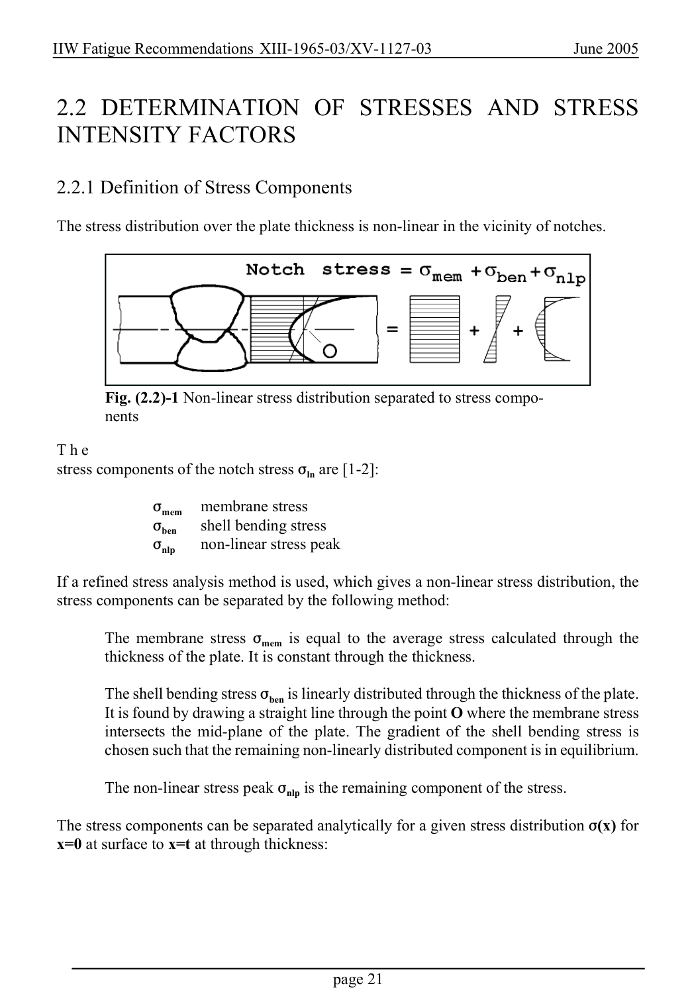

# 2 — Fatigue actions (loading) — pagina PDF 21

Fonte: [IIW — Recommendations for Fatigue Design of Welded Joints and Components](../../sources/iiw.pdf#page=21). Pagina stampata: 21.

> Formule, simboli e associazioni delle tabelle non sono convalidati per il calcolo.

## Testo estratto

IIW Fatigue Recommendations XIII-1965-03/XV-1127-03                   June 2005

2.2 DETERMINATION OF STRESSES AND STRESS INTENSITY FACTORS

2.2.1 Definition of Stress Components

The stress distribution over the plate thickness is non-linear in the vicinity of notches.

Fig. (2.2)-1 Non-linear stress distribution separated to stress compo- nents

T h e stress components of the notch stress Fln are [1-2]:

```text
              Fmem  membrane stress
                 Fben    shell bending stress
                  Fnlp    non-linear stress peak
```

If a refined stress analysis method is used, which gives a non-linear stress distribution, the stress components can be separated by the following method:

The membrane stress Fmem is equal to the average stress calculated through the thickness of the plate. It is constant through the thickness.

The shell bending stress Fben is linearly distributed through the thickness of the plate. It is found by drawing a straight line through the point O where the membrane stress intersects the mid-plane of the plate. The gradient of the shell bending stress is chosen such that the remaining non-linearly distributed component is in equilibrium.

The non-linear stress peak Fnlp is the remaining component of the stress.

The stress components can be separated analytically for a given stress distribution F(x) for x=0 at surface to x=t at through thickness:

page 21

## Pagina di riscontro


