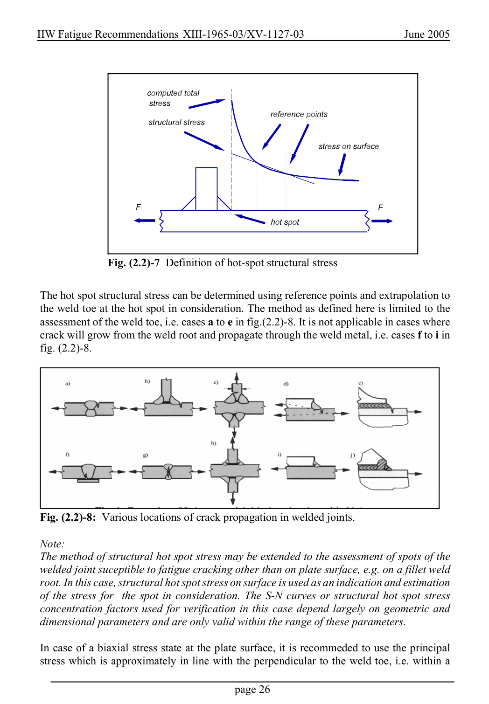

# 2 — Fatigue actions (loading) — pagina PDF 26

Fonte: [IIW — Recommendations for Fatigue Design of Welded Joints and Components](../../sources/iiw.pdf#page=26). Pagina stampata: 26.

> Formule, simboli e associazioni delle tabelle non sono convalidati per il calcolo.

## Testo estratto

IIW Fatigue Recommendations XIII-1965-03/XV-1127-03                   June 2005

Fig. (2.2)-7 Definition of hot-spot structural stress

The hot spot structural stress can be determined using reference points and extrapolation to the weld toe at the hot spot in consideration. The method as defined here is limited to the assessment of the weld toe, i.e. cases a to e in fig.(2.2)-8. It is not applicable in cases where crack will grow from the weld root and propagate through the weld metal, i.e. cases f to i in fig. (2.2)-8.

Fig. (2.2)-8: Various locations of crack propagation in welded joints.

```text
 Note:
The method of structural hot spot stress may be extended to the assessment of spots of the
 welded joint suceptible to fatigue cracking other than on plate surface, e.g. on a fillet weld
 root. In this case, structural hot spot stress on surface is used as an indication and estimation
 of the stress for  the spot in consideration. The S-N curves or structural hot spot stress
 concentration factors used for verification in this case depend largely on geometric and
 dimensional parameters and are only valid within the range of these parameters.
```

In case of a biaxial stress state at the plate surface, it is recommeded to use the principal stress which is approximately in line with the perpendicular to the weld toe, i.e. within a

page 26

## Pagina di riscontro


