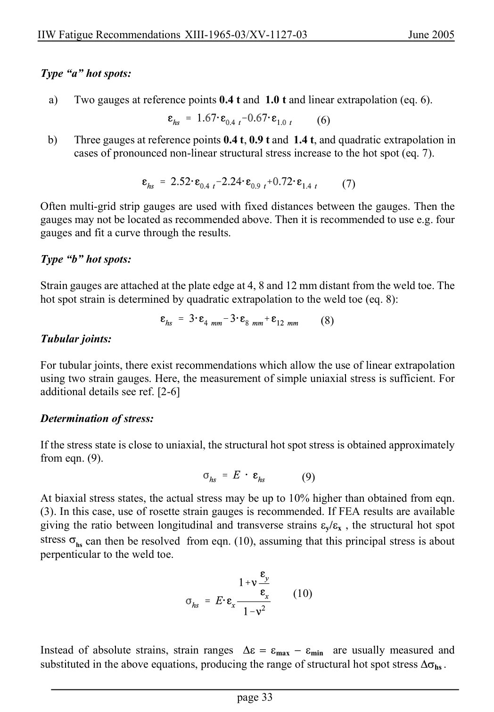

# 2 — Fatigue actions (loading) — pagina PDF 33

Fonte: [IIW — Recommendations for Fatigue Design of Welded Joints and Components](../../sources/iiw.pdf#page=33). Pagina stampata: 33.

> Formule, simboli e associazioni delle tabelle non sono convalidati per il calcolo.

## Testo estratto

IIW Fatigue Recommendations XIII-1965-03/XV-1127-03                   June 2005

Type “a” hot spots:

a)  Two gauges at reference points 0.4 t and 1.0 t and linear extrapolation (eq. 6).

(6)

b)   Three gauges at reference points 0.4 t, 0.9 t and 1.4 t, and quadratic extrapolation in cases of pronounced non-linear structural stress increase to the hot spot (eq. 7).

(7)

Often multi-grid strip gauges are used with fixed distances between the gauges. Then the gauges may not be located as recommended above. Then it is recommended to use e.g. four gauges and fit a curve through the results.

Type “b” hot spots:

Strain gauges are attached at the plate edge at 4, 8 and 12 mm distant from the weld toe. The hot spot strain is determined by quadratic extrapolation to the weld toe (eq. 8):

(8) Tubular joints:

For tubular joints, there exist recommendations which allow the use of linear extrapolation using two strain gauges. Here, the measurement of simple uniaxial stress is sufficient. For additional details see ref. [2-6]

Determination of stress:

```text
 If the stress state is close to uniaxial, the structural hot spot stress is obtained approximately
from eqn. (9).
                                                            (9)
```

At biaxial stress states, the actual stress may be up to 10% higher than obtained from eqn. (3). In this case, use of rosette strain gauges is recommended. If FEA results are available giving the ratio between longitudinal and transverse strains εy/εx , the structural hot spot stress σhs can then be resolved from eqn. (10), assuming that this principal stress is about perpenticular to the weld toe.

(10)

Instead of absolute strains, strain ranges  ∆ε = εmax − εmin  are usually measured and substituted in the above equations, producing the range of structural hot spot stress ∆σhs .

page 33

## Pagina di riscontro


