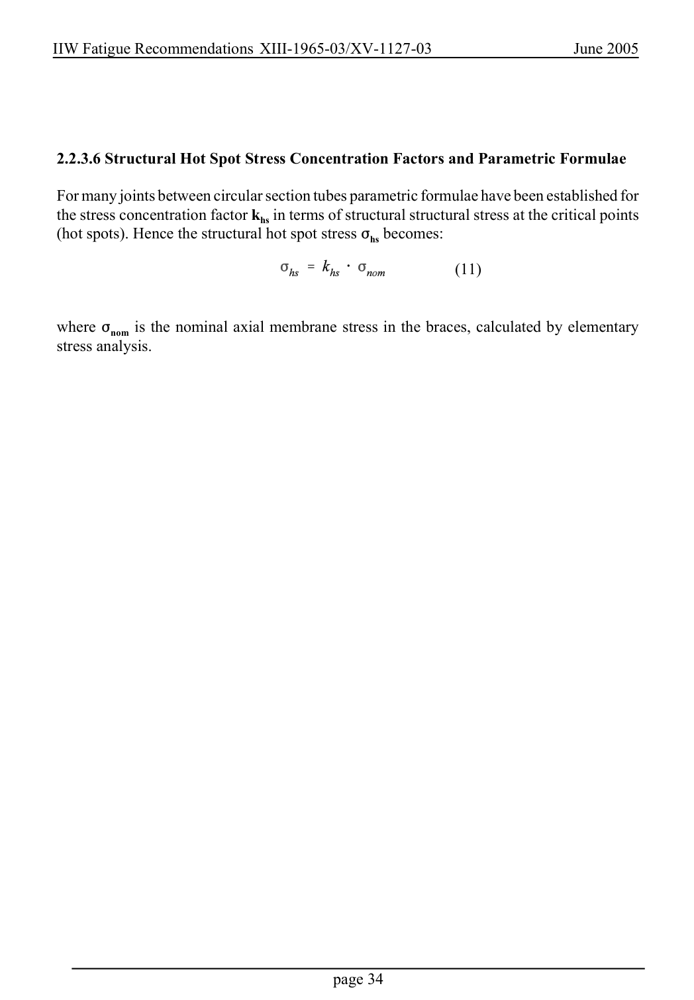

# 2 — Fatigue actions (loading) — pagina PDF 34

Fonte: [IIW — Recommendations for Fatigue Design of Welded Joints and Components](../../sources/iiw.pdf#page=34). Pagina stampata: 34.

> Formule, simboli e associazioni delle tabelle non sono convalidati per il calcolo.

## Testo estratto

IIW Fatigue Recommendations XIII-1965-03/XV-1127-03                   June 2005

2.2.3.6 Structural Hot Spot Stress Concentration Factors and Parametric Formulae

For many joints between circular section tubes parametric formulae have been established for the stress concentration factor khs in terms of structural structural stress at the critical points (hot spots). Hence the structural hot spot stress Fhs becomes:

(11)

where Fnom is the nominal axial membrane stress in the braces, calculated by elementary stress analysis.

page 34

## Pagina di riscontro

