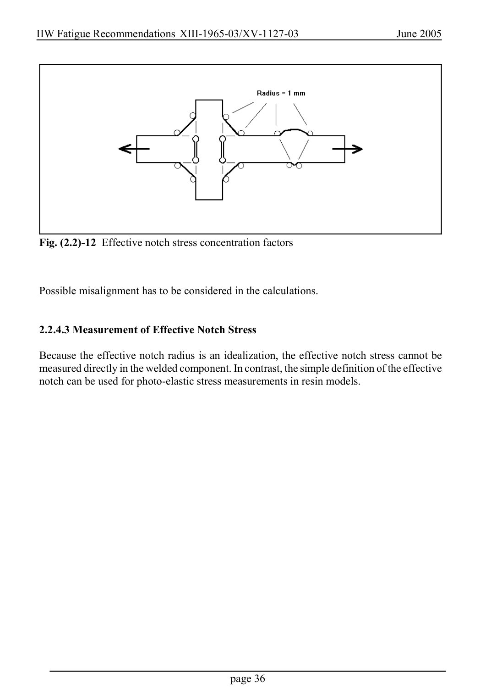

# 2 — Fatigue actions (loading) — pagina PDF 36

Fonte: [IIW — Recommendations for Fatigue Design of Welded Joints and Components](../../sources/iiw.pdf#page=36). Pagina stampata: 36.

> Formule, simboli e associazioni delle tabelle non sono convalidati per il calcolo.

## Testo estratto

IIW Fatigue Recommendations XIII-1965-03/XV-1127-03                   June 2005

Fig. (2.2)-12 Effective notch stress concentration factors

Possible misalignment has to be considered in the calculations.

2.2.4.3 Measurement of Effective Notch Stress

Because the effective notch radius is an idealization, the effective notch stress cannot be measured directly in the welded component. In contrast, the simple definition of the effective notch can be used for photo-elastic stress measurements in resin models.

page 36

## Pagina di riscontro

