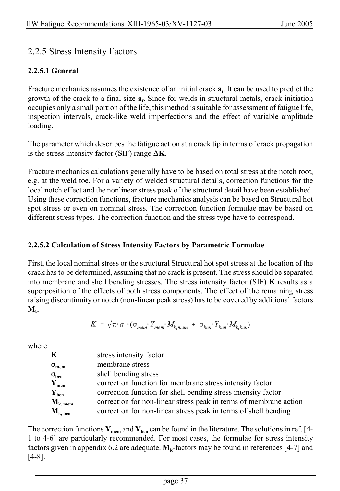

# 2 — Fatigue actions (loading) — pagina PDF 37

Fonte: [IIW — Recommendations for Fatigue Design of Welded Joints and Components](../../sources/iiw.pdf#page=37). Pagina stampata: 37.

> Formule, simboli e associazioni delle tabelle non sono convalidati per il calcolo.

## Testo estratto

IIW Fatigue Recommendations XIII-1965-03/XV-1127-03                   June 2005

2.2.5 Stress Intensity Factors

2.2.5.1 General

Fracture mechanics assumes the existence of an initial crack ai. It can be used to predict the growth of the crack to a final size af. Since for welds in structural metals, crack initiation occupies only a small portion of the life, this method is suitable for assessment of fatigue life, inspection intervals, crack-like weld imperfections and the effect of variable amplitude loading.

The parameter which describes the fatigue action at a crack tip in terms of crack propagation is the stress intensity factor (SIF) range )K.

Fracture mechanics calculations generally have to be based on total stress at the notch root, e.g. at the weld toe. For a variety of welded structural details, correction functions for the local notch effect and the nonlinear stress peak of the structural detail have been established. Using these correction functions, fracture mechanics analysis can be based on Structural hot spot stress or even on nominal stress. The correction function formulae may be based on different stress types. The correction function and the stress type have to correspond.

2.2.5.2 Calculation of Stress Intensity Factors by Parametric Formulae

First, the local nominal stress or the structural Structural hot spot stress at the location of the crack has to be determined, assuming that no crack is present. The stress should be separated into membrane and shell bending stresses. The stress intensity factor (SIF) K results as a superposition of the effects of both stress components. The effect of the remaining stress raising discontinuity or notch (non-linear peak stress) has to be covered by additional factors Mk.

```text
where
    K              stress intensity factor
       Fmem        membrane stress
        Fben            shell bending stress
      Ymem          correction function for membrane stress intensity factor
        Yben          correction function for shell bending stress intensity factor
       Mk, mem       correction for non-linear stress peak in terms of membrane action
       Mk, ben        correction for non-linear stress peak in terms of shell bending
```

The correction functions Ymem and Yben can be found in the literature. The solutions in ref. [4- 1 to 4-6] are particularly recommended. For most cases, the formulae for stress intensity factors given in appendix 6.2 are adequate. Mk-factors may be found in references [4-7] and [4-8].

page 37

## Pagina di riscontro


