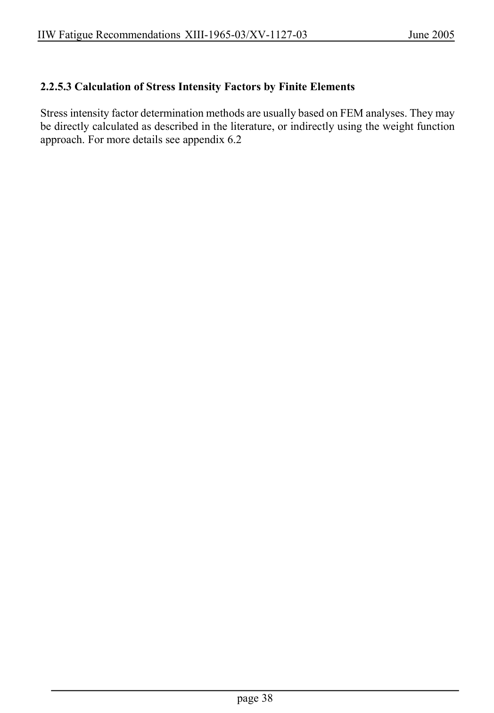

# 2 — Fatigue actions (loading) — pagina PDF 38

Fonte: [IIW — Recommendations for Fatigue Design of Welded Joints and Components](../../sources/iiw.pdf#page=38). Pagina stampata: 38.

> Formule, simboli e associazioni delle tabelle non sono convalidati per il calcolo.

## Testo estratto

IIW Fatigue Recommendations XIII-1965-03/XV-1127-03                   June 2005

2.2.5.3 Calculation of Stress Intensity Factors by Finite Elements

Stress intensity factor determination methods are usually based on FEM analyses. They may be directly calculated as described in the literature, or indirectly using the weight function approach. For more details see appendix 6.2

page 38

## Pagina di riscontro

