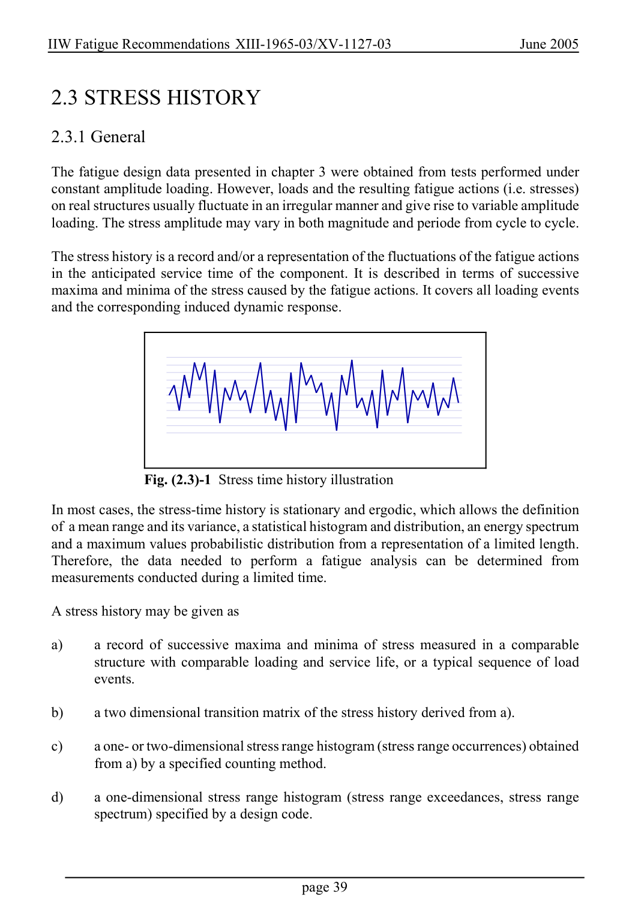

# 2 — Fatigue actions (loading) — pagina PDF 39

Fonte: [IIW — Recommendations for Fatigue Design of Welded Joints and Components](../../sources/iiw.pdf#page=39). Pagina stampata: 39.

> Formule, simboli e associazioni delle tabelle non sono convalidati per il calcolo.

## Testo estratto

IIW Fatigue Recommendations XIII-1965-03/XV-1127-03                   June 2005

2.3 STRESS HISTORY

2.3.1 General

The fatigue design data presented in chapter 3 were obtained from tests performed under constant amplitude loading. However, loads and the resulting fatigue actions (i.e. stresses) on real structures usually fluctuate in an irregular manner and give rise to variable amplitude loading. The stress amplitude may vary in both magnitude and periode from cycle to cycle.

The stress history is a record and/or a representation of the fluctuations of the fatigue actions in the anticipated service time of the component. It is described in terms of successive maxima and minima of the stress caused by the fatigue actions. It covers all loading events and the corresponding induced dynamic response.

Fig. (2.3)-1 Stress time history illustration

```text
 In most cases, the stress-time history is stationary and ergodic, which allows the definition
 of a mean range and its variance, a statistical histogram and distribution, an energy spectrum
and a maximum values probabilistic distribution from a representation of a limited length.
 Therefore, the data needed  to perform a fatigue analysis can be determined from
 measurements conducted during a limited time.
```

A stress history may be given as

```text
 a)     a record of successive maxima and minima of stress measured in a comparable
        structure with comparable loading and service life, or a typical sequence of load
        events.
```

b)     a two dimensional transition matrix of the stress history derived from a).

c)     a one- or two-dimensional stress range histogram (stress range occurrences) obtained from a) by a specified counting method.

d)     a one-dimensional stress range histogram (stress range exceedances, stress range spectrum) specified by a design code.

page 39

## Pagina di riscontro


