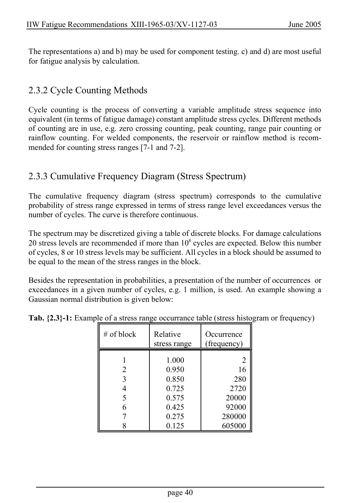

# 2 — Fatigue actions (loading) — pagina PDF 40

Fonte: [IIW — Recommendations for Fatigue Design of Welded Joints and Components](../../sources/iiw.pdf#page=40). Pagina stampata: 40.

> Formule, simboli e associazioni delle tabelle non sono convalidati per il calcolo.

## Testo estratto

IIW Fatigue Recommendations XIII-1965-03/XV-1127-03                   June 2005

The representations a) and b) may be used for component testing. c) and d) are most useful for fatigue analysis by calculation.

2.3.2 Cycle Counting Methods

Cycle counting is the process of converting a variable amplitude stress sequence into equivalent (in terms of fatigue damage) constant amplitude stress cycles. Different methods of counting are in use, e.g. zero crossing counting, peak counting, range pair counting or rainflow counting. For welded components, the reservoir or rainflow method is recom- mended for counting stress ranges [7-1 and 7-2].

2.3.3 Cumulative Frequency Diagram (Stress Spectrum)

```text
The cumulative frequency diagram  (stress spectrum) corresponds to the cumulative
 probability of stress range expressed in terms of stress range level exceedances versus the
number of cycles. The curve is therefore continuous.
```

The spectrum may be discretized giving a table of discrete blocks. For damage calculations 20 stress levels are recommended if more than 108 cycles are expected. Below this number of cycles, 8 or 10 stress levels may be sufficient. All cycles in a block should be assumed to be equal to the mean of the stress ranges in the block.

Besides the representation in probabilities, a presentation of the number of occurrences or exceedances in a given number of cycles, e.g. 1 million, is used. An example showing a Gaussian normal distribution is given below:

Tab. {2.3}-1: Example of a stress range occurrance table (stress histogram or frequency)

# of block     Relative       Occurrence stress range    (frequency)

```text
                        1           1.000              2
                        2           0.950             16
                        3           0.850            280
                        4           0.725           2720
                        5           0.575          20000
                        6           0.425          92000
                        7           0.275         280000
                        8           0.125         605000
```

page 40

## Pagina di riscontro


