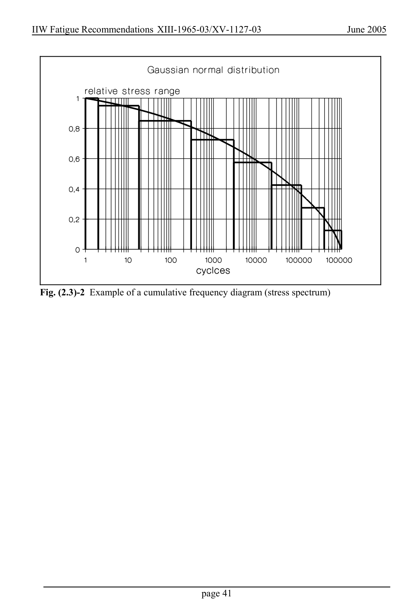

# 2 — Fatigue actions (loading) — pagina PDF 41

Fonte: [IIW — Recommendations for Fatigue Design of Welded Joints and Components](../../sources/iiw.pdf#page=41). Pagina stampata: 41.

> Formule, simboli e associazioni delle tabelle non sono convalidati per il calcolo.

## Testo estratto

IIW Fatigue Recommendations XIII-1965-03/XV-1127-03                   June 2005

Fig. (2.3)-2 Example of a cumulative frequency diagram (stress spectrum)

page 41

## Pagina di riscontro

