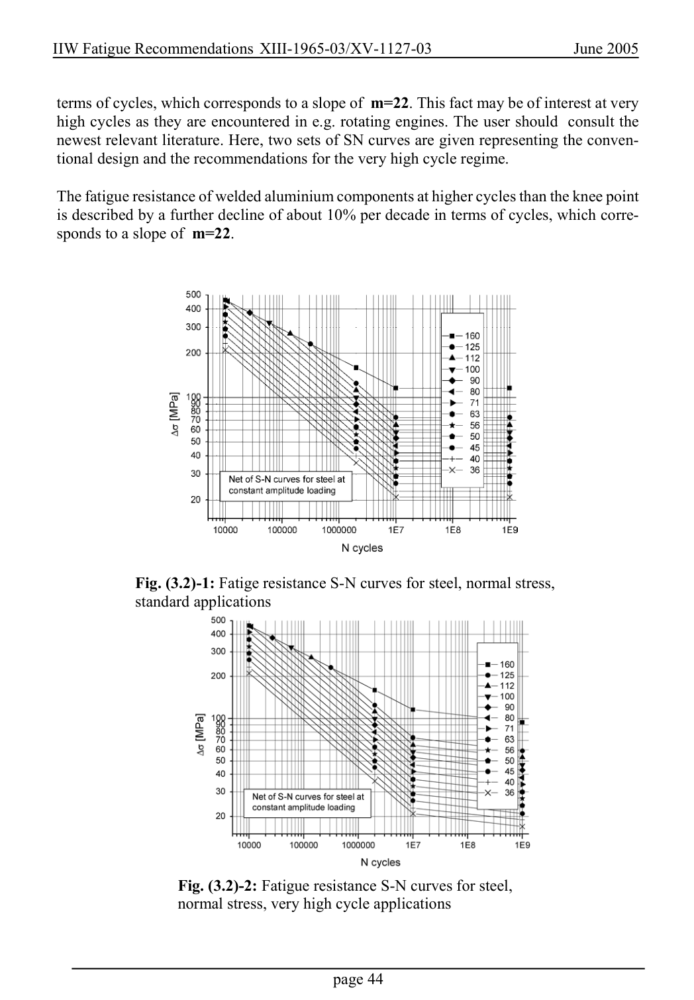

# 3.1–3.2 — Fatigue resistance and classified details — pagina PDF 44

Fonte: [IIW — Recommendations for Fatigue Design of Welded Joints and Components](../../sources/iiw.pdf#page=44). Pagina stampata: 44.

> Formule, simboli e associazioni delle tabelle non sono convalidati per il calcolo.

## Testo estratto

IIW Fatigue Recommendations XIII-1965-03/XV-1127-03                   June 2005

```text
 terms of cycles, which corresponds to a slope of m=22. This fact may be of interest at very
 high cycles as they are encountered in e.g. rotating engines. The user should  consult the
 newest relevant literature. Here, two sets of SN curves are given representing the conven-
 tional design and the recommendations for the very high cycle regime.
```

The fatigue resistance of welded aluminium components at higher cycles than the knee point is described by a further decline of about 10% per decade in terms of cycles, which corre- sponds to a slope of m=22.

Fig. (3.2)-1: Fatige resistance S-N curves for steel, normal stress, standard applications

Fig. (3.2)-2: Fatigue resistance S-N curves for steel, normal stress, very high cycle applications

page 44

## Pagina di riscontro


