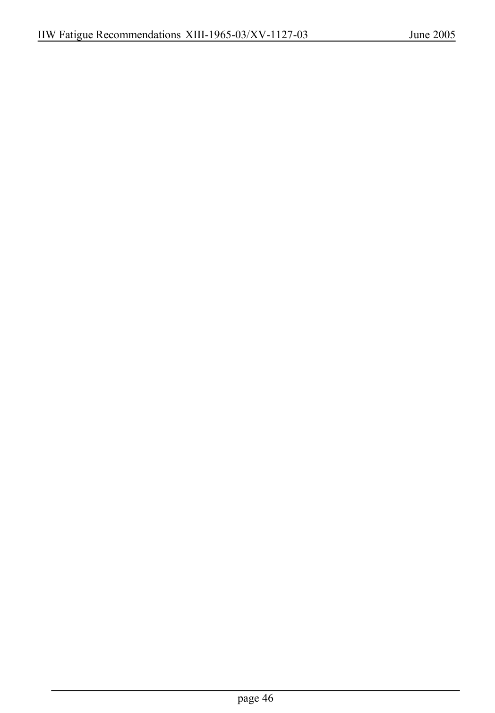

# 3.1–3.2 — Fatigue resistance and classified details — pagina PDF 46

Fonte: [IIW — Recommendations for Fatigue Design of Welded Joints and Components](../../sources/iiw.pdf#page=46). Pagina stampata: 46.

> Formule, simboli e associazioni delle tabelle non sono convalidati per il calcolo. Testo ottenuto con OCR; verificare simboli greci, apici, pedici e disuguaglianze sulla pagina.

## Testo estratto

```text
IIW Fatigue Recommendations XIII-1965-03/XV-1127-03
June 2005
page 46
```

## Pagina di riscontro


