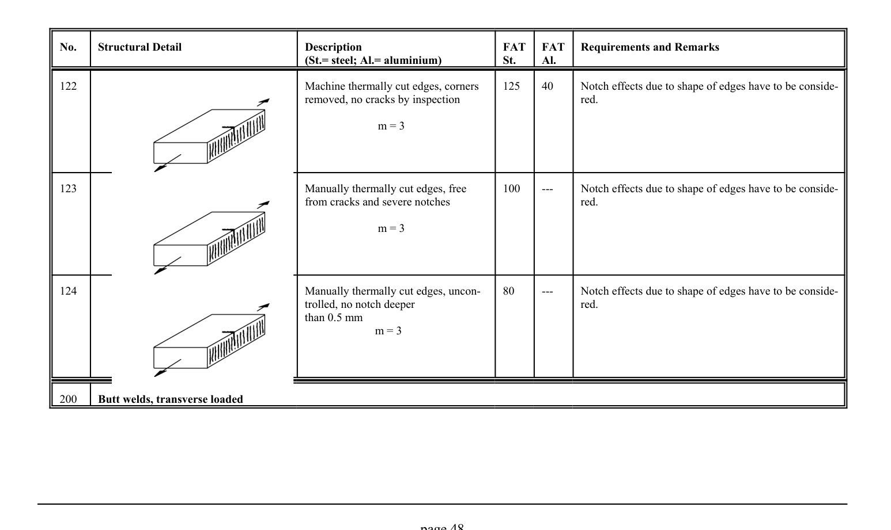

# 3.1–3.2 — Fatigue resistance and classified details — pagina PDF 48

Fonte: [IIW — Recommendations for Fatigue Design of Welded Joints and Components](../../sources/iiw.pdf#page=48). Pagina stampata: 48.

> Formule, simboli e associazioni delle tabelle non sono convalidati per il calcolo.

## Testo estratto

No.    Structural Detail                        Description                  FAT  FAT   Requirements and Remarks (St.= steel; Al.= aluminium)              St.     Al.

122                                       Machine thermally cut edges, corners    125    40     Notch effects due to shape of edges have to be conside- removed, no cracks by inspection                           red.

m = 3

123                                         Manually thermally cut edges, free      100      ---     Notch effects due to shape of edges have to be conside- from cracks and severe notches                              red.

m = 3

```text
124                                         Manually thermally cut edges, uncon-    80       ---     Notch effects due to shape of edges have to be conside-
                                                           trolled, no notch deeper                                      red.
                                                 than 0.5 mm
                                   m = 3
```

200    Butt welds, transverse loaded

page 48

## Tabelle e dettagli

- [iiw-048-t01-d01](../details/iiw-048-t01-d01.md) — steel: 125; aluminium: 40
- [iiw-048-t01-d02](../details/iiw-048-t01-d02.md) — steel: 100; aluminium: ---
- [iiw-048-t01-d03](../details/iiw-048-t01-d03.md) — steel: 80; aluminium: ---

## Pagina di riscontro


