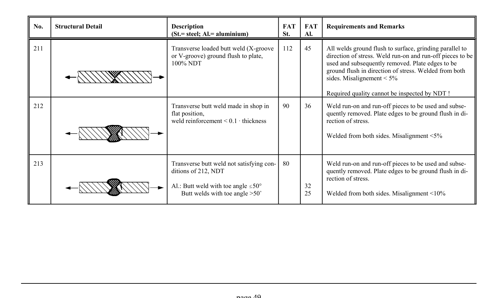

# 3.1–3.2 — Fatigue resistance and classified details — pagina PDF 49

Fonte: [IIW — Recommendations for Fatigue Design of Welded Joints and Components](../../sources/iiw.pdf#page=49). Pagina stampata: 49.

> Formule, simboli e associazioni delle tabelle non sono convalidati per il calcolo.

## Testo estratto

No.    Structural Detail                        Description                  FAT  FAT   Requirements and Remarks (St.= steel; Al.= aluminium)              St.     Al.

```text
211                                             Transverse loaded butt weld (X-groove   112    45      All welds ground flush to surface, grinding parallel to
                                                   or V-groove) ground flush to plate,                         direction of stress. Weld run-on and run-off pieces to be
                                    100% NDT                                          used and subsequently removed. Plate edges to be
                                                                                               ground flush in direction of stress. Welded from both
                                                                                                                        sides. Misalignement < 5%
```

Required quality cannot be inspected by NDT !

```text
212                                             Transverse butt weld made in shop in    90     36    Weld run-on and run-off pieces to be used and subse-
                                                                flat position,                                            quently removed. Plate edges to be ground flush in di-
                                            weld reinforcement < 0.1 A thickness                       rection of stress.
```

Welded from both sides. Misalignment <5%

```text
213                                             Transverse butt weld not satisfying con-  80           Weld run-on and run-off pieces to be used and subse-
                                                      ditions of 212, NDT                                     quently removed. Plate edges to be ground flush in di-
                                                                                                                 rection of stress.
                                                       Al.: Butt weld with toe angle #50°             32
                                                     Butt welds with toe angle >50/             25     Welded from both sides. Misalignment <10%
```

page 49

## Tabelle e dettagli

- [iiw-049-t01-d01](../details/iiw-049-t01-d01.md) — steel: 112; aluminium: 45
- [iiw-049-t01-d02](../details/iiw-049-t01-d02.md) — steel: 90; aluminium: 36
- [iiw-049-t01-d03](../details/iiw-049-t01-d03.md) — steel: 80; aluminium: 32; 25

## Pagina di riscontro


