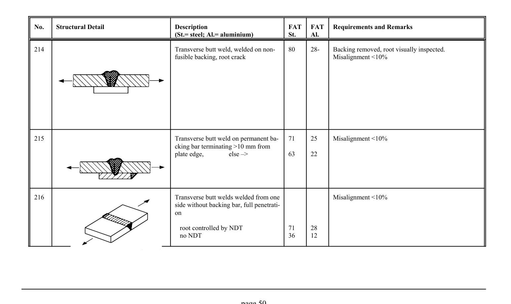

# 3.1–3.2 — Fatigue resistance and classified details — pagina PDF 50

Fonte: [IIW — Recommendations for Fatigue Design of Welded Joints and Components](../../sources/iiw.pdf#page=50). Pagina stampata: 50.

> Formule, simboli e associazioni delle tabelle non sono convalidati per il calcolo.

## Testo estratto

No.    Structural Detail                        Description                  FAT  FAT   Requirements and Remarks (St.= steel; Al.= aluminium)              St.     Al.

214                                             Transverse butt weld, welded on non-    80     28-    Backing removed, root visually inspected. fusible backing, root crack                            Misalignment <10%

```text
215                                             Transverse butt weld on permanent ba-   71     25     Misalignment <10%
                                                cking bar terminating >10 mm from
                                                      plate edge,          else –>            63     22
```

```text
216                                             Transverse butt welds welded from one                 Misalignment <10%
                                                     side without backing bar, full penetrati-
                                          on
```

root controlled by NDT              71     28 no NDT                          36     12

page 50

## Tabelle e dettagli

- [iiw-050-t01-d01](../details/iiw-050-t01-d01.md) — steel: 80; aluminium: 28-
- [iiw-050-t01-d02](../details/iiw-050-t01-d02.md) — steel: 71; ; 63; aluminium: 25; ; 22
- [iiw-050-t01-d03](../details/iiw-050-t01-d03.md) — steel: 71; 36; aluminium: 28; 12

## Pagina di riscontro


