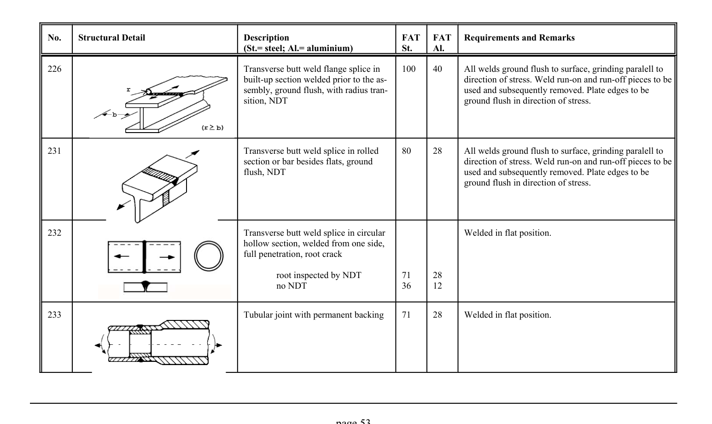

# 3.1–3.2 — Fatigue resistance and classified details — pagina PDF 53

Fonte: [IIW — Recommendations for Fatigue Design of Welded Joints and Components](../../sources/iiw.pdf#page=53). Pagina stampata: 53.

> Formule, simboli e associazioni delle tabelle non sono convalidati per il calcolo.

## Testo estratto

No.    Structural Detail                        Description                  FAT  FAT   Requirements and Remarks (St.= steel; Al.= aluminium)              St.     Al.

```text
226                                             Transverse butt weld flange splice in     100    40      All welds ground flush to surface, grinding paralell to
                                                      built-up section welded prior to the as-                     direction of stress. Weld run-on and run-off pieces to be
                                               sembly, ground flush, with radius tran-                  used and subsequently removed. Plate edges to be
                                                            sition, NDT                                        ground flush in direction of stress.
```

```text
231                                             Transverse butt weld splice in rolled     80     28      All welds ground flush to surface, grinding paralell to
                                                    section or bar besides flats, ground                         direction of stress. Weld run-on and run-off pieces to be
                                                        flush, NDT                                          used and subsequently removed. Plate edges to be
                                                                                               ground flush in direction of stress.
```

```text
232                                             Transverse butt weld splice in circular                Welded in flat position.
                                              hollow section, welded from one side,
                                                             full penetration, root crack
```

root inspected by NDT         71     28 no NDT                     36     12

233                                            Tubular joint with permanent backing    71     28     Welded in flat position.

page 53

## Tabelle e dettagli

- [iiw-053-t01-d01](../details/iiw-053-t01-d01.md) — steel: 100; aluminium: 40
- [iiw-053-t01-d02](../details/iiw-053-t01-d02.md) — steel: 80; aluminium: 28
- [iiw-053-t01-d03](../details/iiw-053-t01-d03.md) — steel: 71; 36; aluminium: 28; 12
- [iiw-053-t01-d04](../details/iiw-053-t01-d04.md) — steel: 71; aluminium: 28

## Pagina di riscontro


