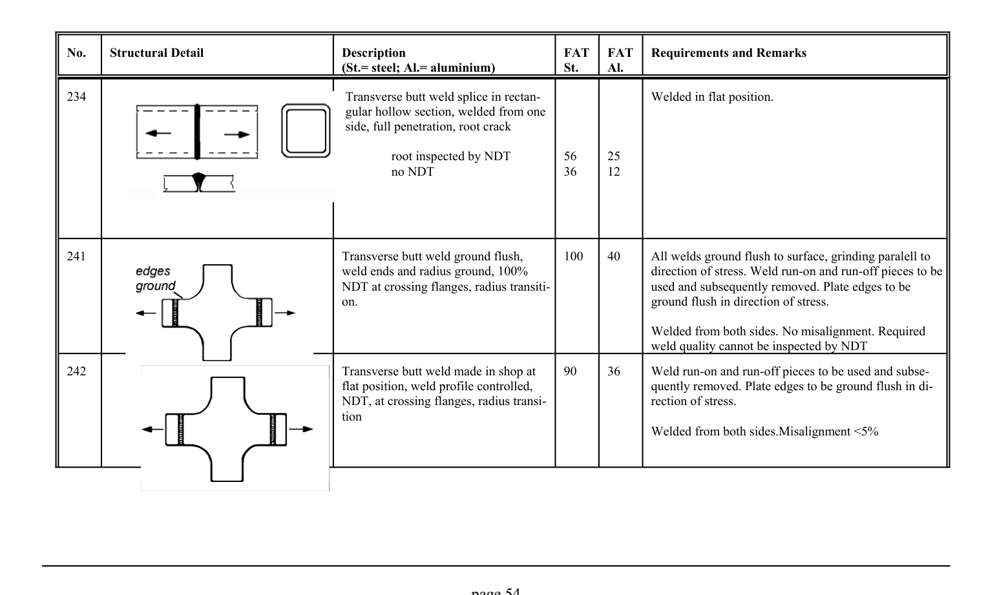

# 3.1–3.2 — Fatigue resistance and classified details — pagina PDF 54

Fonte: [IIW — Recommendations for Fatigue Design of Welded Joints and Components](../../sources/iiw.pdf#page=54). Pagina stampata: 54.

> Formule, simboli e associazioni delle tabelle non sono convalidati per il calcolo.

## Testo estratto

No.    Structural Detail                        Description                  FAT  FAT   Requirements and Remarks (St.= steel; Al.= aluminium)              St.     Al.

```text
234                                              Transverse butt weld splice in rectan-                Welded in flat position.
                                                    gular hollow section, welded from one
                                                          side, full penetration, root crack
```

root inspected by NDT        56     25 no NDT                    36     12

```text
241                                             Transverse butt weld ground flush,      100    40      All welds ground flush to surface, grinding paralell to
                                            weld ends and radius ground, 100%                        direction of stress. Weld run-on and run-off pieces to be
                               NDT at crossing flanges, radius transiti-                 used and subsequently removed. Plate edges to be
                                                   on.                                                ground flush in direction of stress.
```

Welded from both sides. No misalignment. Required weld quality cannot be inspected by NDT

```text
242                                             Transverse butt weld made in shop at    90     36    Weld run-on and run-off pieces to be used and subse-
                                                                flat position, weld profile controlled,                     quently removed. Plate edges to be ground flush in di-
                                     NDT, at crossing flanges, radius transi-                    rection of stress.
                                                       tion
                                                                                       Welded from both sides.Misalignment <5%
```

page 54

## Tabelle e dettagli

- [iiw-054-t01-d01](../details/iiw-054-t01-d01.md) — steel: 56; 36; aluminium: 25; 12
- [iiw-054-t01-d02](../details/iiw-054-t01-d02.md) — steel: 100; aluminium: 40
- [iiw-054-t01-d03](../details/iiw-054-t01-d03.md) — steel: 90; aluminium: 36

## Pagina di riscontro


