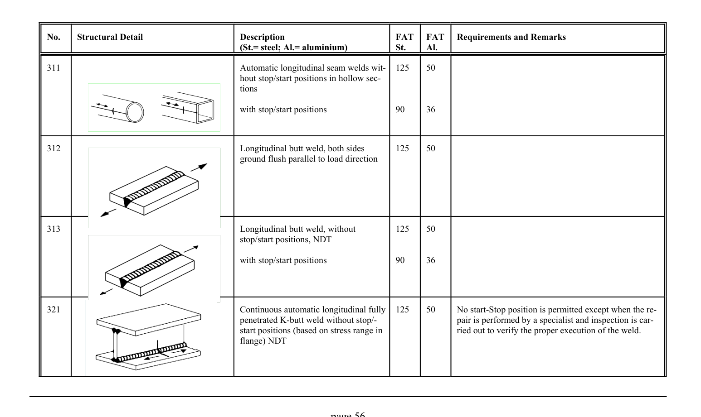

# 3.1–3.2 — Fatigue resistance and classified details — pagina PDF 56

Fonte: [IIW — Recommendations for Fatigue Design of Welded Joints and Components](../../sources/iiw.pdf#page=56). Pagina stampata: 56.

> Formule, simboli e associazioni delle tabelle non sono convalidati per il calcolo.

## Testo estratto

No.    Structural Detail                        Description                  FAT  FAT   Requirements and Remarks (St.= steel; Al.= aluminium)              St.     Al.

```text
311                                          Automatic longitudinal seam welds wit-  125    50
                                                hout stop/start positions in hollow sec-
                                                       tions
```

with stop/start positions               90     36

312                                              Longitudinal butt weld, both sides       125    50 ground flush parallel to load direction

313                                              Longitudinal butt weld, without         125    50 stop/start positions, NDT

with stop/start positions               90     36

```text
321                                           Continuous automatic longitudinal fully  125    50    No start-Stop position is permitted except when the re-
                                                   penetrated K-butt weld without stop/-                       pair is performed by a specialist and inspection is car-
                                                              start positions (based on stress range in                     ried out to verify the proper execution of the weld.
                                                    flange) NDT
```

page 56

## Tabelle e dettagli

- [iiw-056-t01-d01](../details/iiw-056-t01-d01.md) — steel: 125; ; ; ; 90; aluminium: 50; ; ; ; 36
- [iiw-056-t01-d02](../details/iiw-056-t01-d02.md) — steel: 125; aluminium: 50
- [iiw-056-t01-d03](../details/iiw-056-t01-d03.md) — steel: 125; ; ; 90; aluminium: 50; ; ; 36
- [iiw-056-t01-d04](../details/iiw-056-t01-d04.md) — steel: 125; aluminium: 50

## Pagina di riscontro


