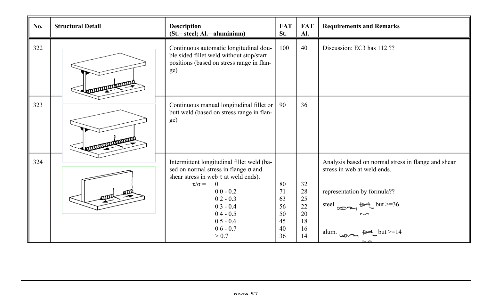

# 3.1–3.2 — Fatigue resistance and classified details — pagina PDF 57

Fonte: [IIW — Recommendations for Fatigue Design of Welded Joints and Components](../../sources/iiw.pdf#page=57). Pagina stampata: 57.

> Formule, simboli e associazioni delle tabelle non sono convalidati per il calcolo.

## Testo estratto

No.    Structural Detail                        Description                  FAT  FAT   Requirements and Remarks (St.= steel; Al.= aluminium)              St.     Al.

```text
322                                           Continuous automatic longitudinal dou-  100    40      Discussion: EC3 has 112 ??
                                                    ble sided fillet weld without stop/start
                                                     positions (based on stress range in flan-
                                                  ge)
```

```text
323                                           Continuous manual longitudinal fillet or  90     36
                                                      butt weld (based on stress range in flan-
                                                  ge)
```

```text
324                                                  Intermittent longitudinal fillet weld (ba-                  Analysis based on normal stress in flange and shear
                                                sed on normal stress in flange F and                         stress in web at weld ends.
                                                  shear stress in web J at weld ends).
                                                        J/F =   0                   80     32
                                                                    0.0 - 0.2             71     28      representation by formula??
                                                                    0.2 - 0.3             63     25
                                                                                                                           steel               but >=36                                                                    0.3 - 0.4             56     22
                                                                    0.4 - 0.5             50     20
                                                                    0.5 - 0.6             45     18
                                                                    0.6 - 0.7             40     16                                                                                                     alum.               but >=14
                                                  > 0.7                36     14
```

page 57

## Tabelle e dettagli

- [iiw-057-t01-d01](../details/iiw-057-t01-d01.md) — steel: 100; aluminium: 40
- [iiw-057-t01-d02](../details/iiw-057-t01-d02.md) — steel: 90; aluminium: 36
- [iiw-057-t01-d03](../details/iiw-057-t01-d03.md) — steel: 80; 71; 63; 56; 50; 45; 40; 36; aluminium: 32; 28; 25; 22; 20; 18; 16; 14

## Pagina di riscontro


