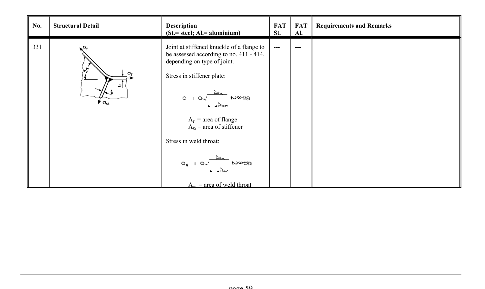

# 3.1–3.2 — Fatigue resistance and classified details — pagina PDF 59

Fonte: [IIW — Recommendations for Fatigue Design of Welded Joints and Components](../../sources/iiw.pdf#page=59). Pagina stampata: 59.

> Formule, simboli e associazioni delle tabelle non sono convalidati per il calcolo.

## Testo estratto

No.    Structural Detail                        Description                  FAT  FAT   Requirements and Remarks (St.= steel; Al.= aluminium)              St.     Al.

```text
331                                                   Joint at stiffened knuckle of a flange to    ---       ---
                                             be assessed according to no. 411 - 414,
                                              depending on type of joint.
```

Stress in stiffener plate:

Af = area of flange ASt = area of stiffener

Stress in weld throat:

Aw = area of weld throat

page 59

## Tabelle e dettagli

- [iiw-059-t01-d01](../details/iiw-059-t01-d01.md) — steel: ---; aluminium: ---

## Pagina di riscontro


