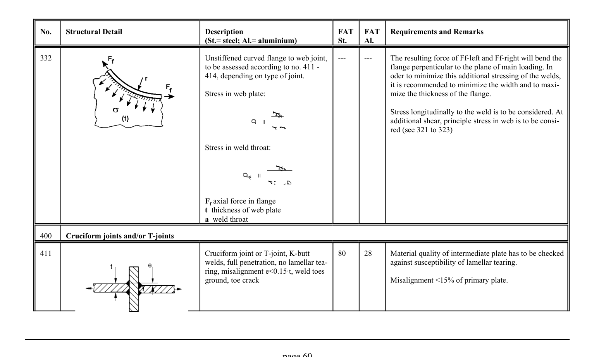

# 3.1–3.2 — Fatigue resistance and classified details — pagina PDF 60

Fonte: [IIW — Recommendations for Fatigue Design of Welded Joints and Components](../../sources/iiw.pdf#page=60). Pagina stampata: 60.

> Formule, simboli e associazioni delle tabelle non sono convalidati per il calcolo.

## Testo estratto

No.    Structural Detail                        Description                  FAT  FAT   Requirements and Remarks (St.= steel; Al.= aluminium)              St.     Al.

```text
332                                              Unstiffened curved flange to web joint,    ---       ---     The resulting force of Ff-left and Ff-right will bend the
                                                      to be assessed according to no. 411 -                      flange perpenticular to the plane of main loading. In
                                                414, depending on type of joint.                         oder to minimize this additional stressing of the welds,
                                                                                                                                                                  it is recommended to minimize the width and to maxi-
                                                     Stress in web plate:                                 mize the thickness of the flange.
```

Stress longitudinally to the weld is to be considered. At additional shear, principle stress in web is to be consi- red (see 321 to 323)

Stress in weld throat:

```text
                                                    Ff axial force in flange
                                                                t thickness of web plate
                                          a weld throat
```

400    Cruciform joints and/or T-joints

```text
411                                           Cruciform joint or T-joint, K-butt       80     28      Material quality of intermediate plate has to be checked
                                                 welds, full penetration, no lamellar tea-                    against susceptibility of lamellar tearing.
                                                         ring, misalignment e<0.15At, weld toes
                                                ground, toe crack                                     Misalignment <15% of primary plate.
```

page 60

## Tabelle e dettagli

- [iiw-060-t01-d01](../details/iiw-060-t01-d01.md) — steel: ---; aluminium: ---
- [iiw-060-t01-d02](../details/iiw-060-t01-d02.md) — steel: 80; aluminium: 28

## Pagina di riscontro


