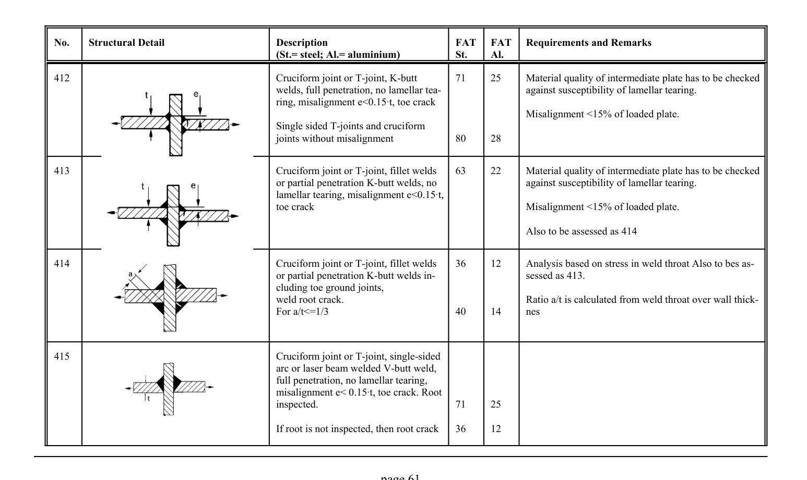

# 3.1–3.2 — Fatigue resistance and classified details — pagina PDF 61

Fonte: [IIW — Recommendations for Fatigue Design of Welded Joints and Components](../../sources/iiw.pdf#page=61). Pagina stampata: 61.

> Formule, simboli e associazioni delle tabelle non sono convalidati per il calcolo.

## Testo estratto

No.    Structural Detail                        Description                  FAT  FAT   Requirements and Remarks (St.= steel; Al.= aluminium)              St.     Al.

```text
412                                           Cruciform joint or T-joint, K-butt       71     25      Material quality of intermediate plate has to be checked
                                                 welds, full penetration, no lamellar tea-                    against susceptibility of lamellar tearing.
                                                         ring, misalignment e<0.15At, toe crack
                                                                                                 Misalignment <15% of loaded plate.
                                                  Single sided T-joints and cruciform
                                                         joints without misalignment            80     28
```

```text
413                                           Cruciform joint or T-joint, fillet welds    63     22      Material quality of intermediate plate has to be checked
                                                   or partial penetration K-butt welds, no                     against susceptibility of lamellar tearing.
                                                    lamellar tearing, misalignment e<0.15At,
                                                    toe crack                                            Misalignment <15% of loaded plate.
```

Also to be assessed as 414

```text
414                                           Cruciform joint or T-joint, fillet welds    36     12     Analysis based on stress in weld throat Also to bes as-
                                                   or partial penetration K-butt welds in-                    sessed as 413.
                                                 cluding toe ground joints,
                                            weld root crack.                                        Ratio a/t is calculated from weld throat over wall thick-
                                              For a/t<=1/3                        40     14     nes
```

```text
415                                           Cruciform joint or T-joint, single-sided
                                                    arc or laser beam welded V-butt weld,
                                                             full penetration, no lamellar tearing,
                                               misalignment e< 0.15At, toe crack. Root
                                                     inspected.                          71     25
```

If root is not inspected, then root crack   36     12

page 61

## Tabelle e dettagli

- [iiw-061-t01-d01](../details/iiw-061-t01-d01.md) — steel: 71; ; ; ; ; 80; aluminium: 25; ; ; ; ; 28
- [iiw-061-t01-d02](../details/iiw-061-t01-d02.md) — steel: 63; aluminium: 22
- [iiw-061-t01-d03](../details/iiw-061-t01-d03.md) — steel: 36; ; ; ; 40; aluminium: 12; ; ; ; 14
- [iiw-061-t01-d04](../details/iiw-061-t01-d04.md) — steel: 71; ; 36; aluminium: 25; ; 12

## Pagina di riscontro


