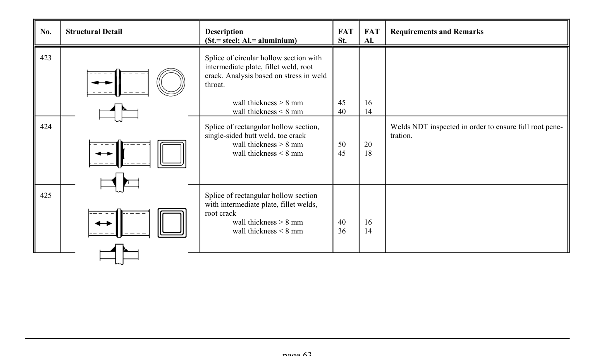

# 3.1–3.2 — Fatigue resistance and classified details — pagina PDF 63

Fonte: [IIW — Recommendations for Fatigue Design of Welded Joints and Components](../../sources/iiw.pdf#page=63). Pagina stampata: 63.

> Formule, simboli e associazioni delle tabelle non sono convalidati per il calcolo.

## Testo estratto

No.    Structural Detail                        Description                  FAT  FAT   Requirements and Remarks (St.= steel; Al.= aluminium)              St.     Al.

```text
423                                               Splice of circular hollow section with
                                                   intermediate plate, fillet weld, root
                                                     crack. Analysis based on stress in weld
                                                          throat.
```

wall thickness > 8 mm         45     16 wall thickness < 8 mm         40     14

```text
424                                               Splice of rectangular hollow section,                  Welds NDT inspected in order to ensure full root pene-
                                                     single-sided butt weld, toe crack                              tration.
                                                         wall thickness > 8 mm         50     20
                                                         wall thickness < 8 mm         45     18
```

```text
425                                               Splice of rectangular hollow section
                                                with intermediate plate, fillet welds,
                                                     root crack
                                                         wall thickness > 8 mm         40     16
                                                         wall thickness < 8 mm         36     14
```

page 63

## Tabelle e dettagli

- [iiw-063-t01-d01](../details/iiw-063-t01-d01.md) — steel: 45; 40; aluminium: 16; 14
- [iiw-063-t01-d02](../details/iiw-063-t01-d02.md) — steel: 50; 45; aluminium: 20; 18
- [iiw-063-t01-d03](../details/iiw-063-t01-d03.md) — steel: 40; 36; aluminium: 16; 14

## Pagina di riscontro


