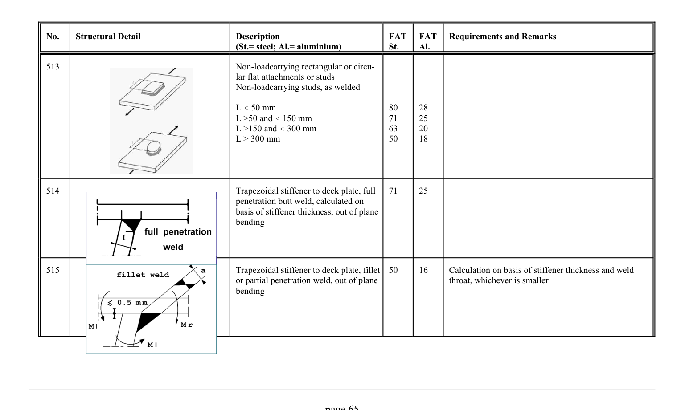

# 3.1–3.2 — Fatigue resistance and classified details — pagina PDF 65

Fonte: [IIW — Recommendations for Fatigue Design of Welded Joints and Components](../../sources/iiw.pdf#page=65). Pagina stampata: 65.

> Formule, simboli e associazioni delle tabelle non sono convalidati per il calcolo.

## Testo estratto

No.    Structural Detail                        Description                  FAT  FAT   Requirements and Remarks (St.= steel; Al.= aluminium)              St.     Al.

```text
513                                            Non-loadcarrying rectangular or circu-
                                                            lar flat attachments or studs
                                                Non-loadcarrying studs, as welded
```

```text
                                   L # 50 mm                         80     28
                                   L >50 and # 150 mm                 71     25
                                   L >150 and # 300 mm                63     20
                                   L > 300 mm                        50     18
```

```text
514                                             Trapezoidal stiffener to deck plate, full   71     25
                                                    penetration butt weld, calculated on
                                                     basis of stiffener thickness, out of plane
                                              bending
```

```text
515                                             Trapezoidal stiffener to deck plate, fillet  50     16      Calculation on basis of stiffener thickness and weld
                                                   or partial penetration weld, out of plane                      throat, whichever is smaller
                                              bending
```

page 65

## Tabelle e dettagli

- [iiw-065-t01-d01](../details/iiw-065-t01-d01.md) — steel: 80; 71; 63; 50; aluminium: 28; 25; 20; 18
- [iiw-065-t01-d02](../details/iiw-065-t01-d02.md) — steel: 71; aluminium: 25
- [iiw-065-t01-d03](../details/iiw-065-t01-d03.md) — steel: 50; aluminium: 16

## Pagina di riscontro


