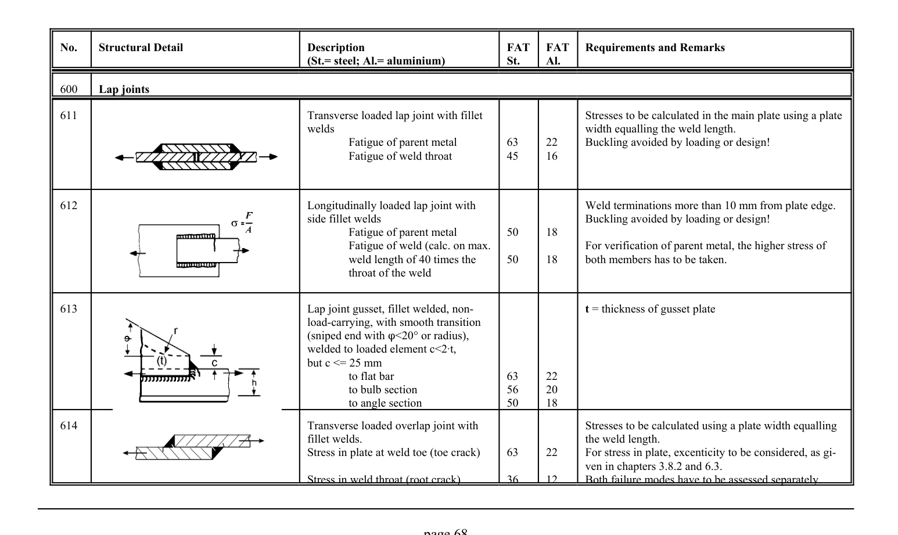

# 3.1–3.2 — Fatigue resistance and classified details — pagina PDF 68

Fonte: [IIW — Recommendations for Fatigue Design of Welded Joints and Components](../../sources/iiw.pdf#page=68). Pagina stampata: 68.

> Formule, simboli e associazioni delle tabelle non sono convalidati per il calcolo.

## Testo estratto

No.    Structural Detail                        Description                  FAT  FAT   Requirements and Remarks (St.= steel; Al.= aluminium)              St.     Al.

600   Lap joints

```text
611                                             Transverse loaded lap joint with fillet                      Stresses to be calculated in the main plate using a plate
                                             welds                                               width equalling the weld length.
                                                          Fatigue of parent metal         63     22     Buckling avoided by loading or design!
                                                          Fatigue of weld throat         45     16
```

```text
612                                              Longitudinally loaded lap joint with                 Weld terminations more than 10 mm from plate edge.
                                                     side fillet welds                                      Buckling avoided by loading or design!
                                                          Fatigue of parent metal         50     18
                                                          Fatigue of weld (calc. on max.                 For verification of parent metal, the higher stress of
                                                   weld length of 40 times the     50     18     both members has to be taken.
                                                                throat of the weld
```

```text
613                                      Lap joint gusset, fillet welded, non-                             t = thickness of gusset plate
                                                     load-carrying, with smooth transition
                                                  (sniped end with n<20° or radius),
                                            welded to loaded element c<2At,
                                                  but c <= 25 mm
                                                                to flat bar                   63     22
                                                                to bulb section               56     20
                                                                to angle section               50     18
```

```text
614                                             Transverse loaded overlap joint with                       Stresses to be calculated using a plate width equalling
                                                                   fillet welds.                                               the weld length.
                                                     Stress in plate at weld toe (toe crack)     63     22     For stress in plate, excenticity to be considered, as gi-
                                                                                              ven in chapters 3.8.2 and 6.3.
                                                     Stress in weld throat (root crack)        36     12     Both failure modes have to be assessed separately.
```

page 68

## Tabelle e dettagli

- [iiw-068-t01-d01](../details/iiw-068-t01-d01.md) — aluminium: 22; 16; steel: 63; 45
- [iiw-068-t01-d02](../details/iiw-068-t01-d02.md) — aluminium: 18; ; 18; steel: 50; ; 50
- [iiw-068-t01-d03](../details/iiw-068-t01-d03.md) — aluminium: 22; 20; 18; steel: 63; 56; 50
- [iiw-068-t01-d04](../details/iiw-068-t01-d04.md) — aluminium: 22; ; 12; steel: 63; ; 36

## Pagina di riscontro


