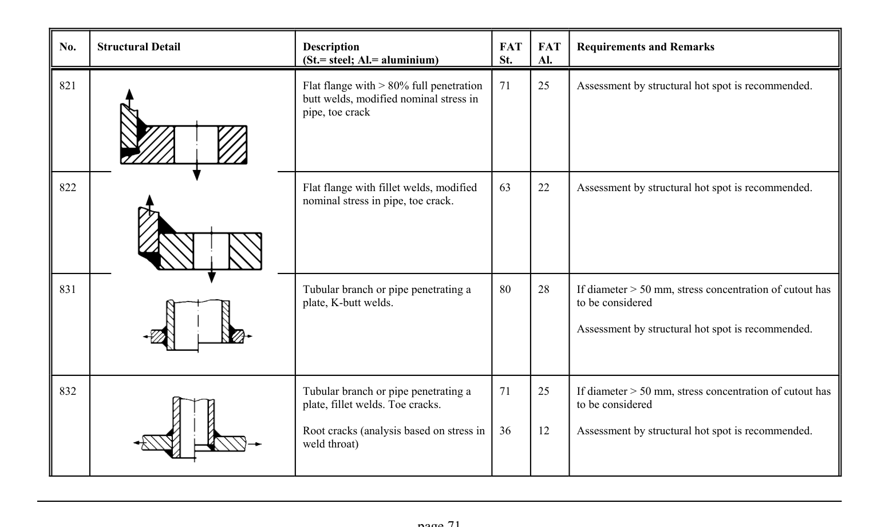

# 3.1–3.2 — Fatigue resistance and classified details — pagina PDF 71

Fonte: [IIW — Recommendations for Fatigue Design of Welded Joints and Components](../../sources/iiw.pdf#page=71). Pagina stampata: 71.

> Formule, simboli e associazioni delle tabelle non sono convalidati per il calcolo.

## Testo estratto

No.    Structural Detail                        Description                  FAT  FAT   Requirements and Remarks (St.= steel; Al.= aluminium)              St.     Al.

```text
821                                                   Flat flange with > 80% full penetration   71     25     Assessment by structural hot spot is recommended.
                                                      butt welds, modified nominal stress in
                                                      pipe, toe crack
```

822                                                   Flat flange with fillet welds, modified    63     22     Assessment by structural hot spot is recommended. nominal stress in pipe, toe crack.

831                                            Tubular branch or pipe penetrating a     80     28       If diameter > 50 mm, stress concentration of cutout has plate, K-butt welds.                                         to be considered

Assessment by structural hot spot is recommended.

832                                            Tubular branch or pipe penetrating a     71     25       If diameter > 50 mm, stress concentration of cutout has plate, fillet welds. Toe cracks.                              to be considered

Root cracks (analysis based on stress in  36     12     Assessment by structural hot spot is recommended. weld throat)

page 71

## Tabelle e dettagli

- [iiw-071-t01-d01](../details/iiw-071-t01-d01.md) — steel: 71; aluminium: 25
- [iiw-071-t01-d02](../details/iiw-071-t01-d02.md) — steel: 63; aluminium: 22
- [iiw-071-t01-d03](../details/iiw-071-t01-d03.md) — steel: 80; aluminium: 28
- [iiw-071-t01-d04](../details/iiw-071-t01-d04.md) — steel: 71; ; ; 36; aluminium: 25; ; ; 12

## Pagina di riscontro


