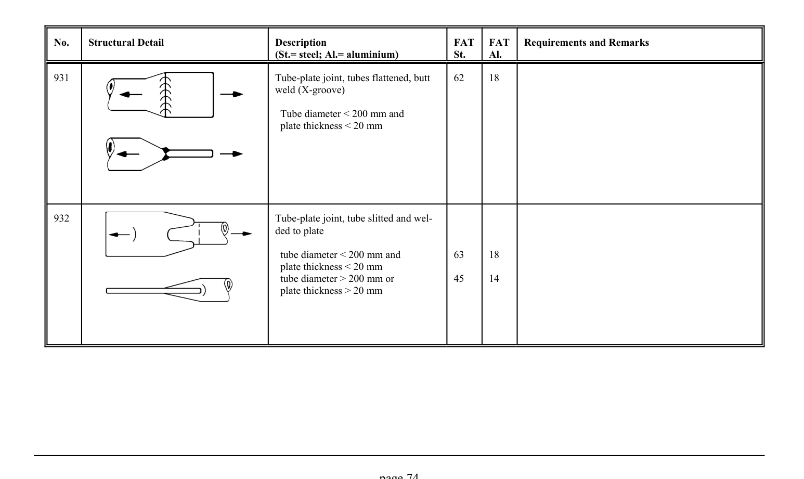

# 3.1–3.2 — Fatigue resistance and classified details — pagina PDF 74

Fonte: [IIW — Recommendations for Fatigue Design of Welded Joints and Components](../../sources/iiw.pdf#page=74). Pagina stampata: 74.

> Formule, simboli e associazioni delle tabelle non sono convalidati per il calcolo.

## Testo estratto

No.    Structural Detail                        Description                  FAT  FAT   Requirements and Remarks (St.= steel; Al.= aluminium)              St.     Al.

931                                             Tube-plate joint, tubes flattened, butt     62     18 weld (X-groove)

Tube diameter < 200 mm and plate thickness < 20 mm

932                                             Tube-plate joint, tube slitted and wel- ded to plate

```text
                                                  tube diameter < 200 mm and          63     18
                                                        plate thickness < 20 mm
                                                  tube diameter > 200 mm or           45     14
                                                        plate thickness > 20 mm
```

page 74

## Tabelle e dettagli

- [iiw-074-t01-d01](../details/iiw-074-t01-d01.md) — steel: 62; aluminium: 18
- [iiw-074-t01-d02](../details/iiw-074-t01-d02.md) — steel: 63; ; 45; aluminium: 18; ; 14

## Pagina di riscontro


