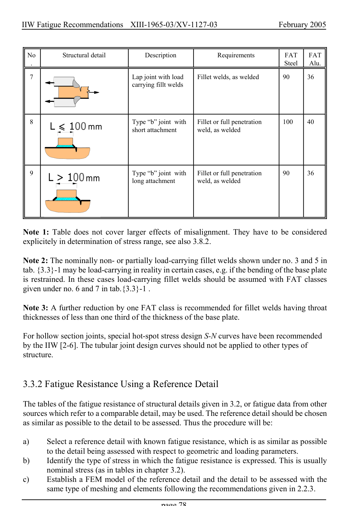

# 3.3–3.8 — Local methods, modifications and imperfections — pagina PDF 78

Fonte: [IIW — Recommendations for Fatigue Design of Welded Joints and Components](../../sources/iiw.pdf#page=78). Pagina stampata: 78.

> Formule, simboli e associazioni delle tabelle non sono convalidati per il calcolo.

## Testo estratto

IIW Fatigue Recommendations  XIII-1965-03/XV-1127-03                 February 2005

No          Structural detail              Description             Requirements       FAT   FAT .                                                                                              Steel    Alu.

7                            Lap joint with load      Fillet welds, as welded       90     36 carrying fillt welds

8                             Type “b” joint with     Fillet or full penetration      100    40 short attachment       weld, as welded

9                             Type “b” joint with     Fillet or full penetration      90     36 long attachment       weld, as welded

Note 1: Table does not cover larger effects of misalignment. They have to be considered explicitely in determination of stress range, see also 3.8.2.

Note 2: The nominally non- or partially load-carrying fillet welds shown under no. 3 and 5 in tab. {3.3}-1 may be load-carrying in reality in certain cases, e.g. if the bending of the base plate is restrained. In these cases load-carrying fillet welds should be assumed with FAT classes given under no. 6 and 7 in tab.{3.3}-1 .

Note 3: A further reduction by one FAT class is recommended for fillet welds having throat thicknesses of less than one third of the thickness of the base plate.

For hollow section joints, special hot-spot stress design S-N curves have been recommended by the IIW [2-6]. The tubular joint design curves should not be applied to other types of structure.

3.3.2 Fatigue Resistance Using a Reference Detail

The tables of the fatigue resistance of structural details given in 3.2, or fatigue data from other sources which refer to a comparable detail, may be used. The reference detail should be chosen as similar as possible to the detail to be assessed. Thus the procedure will be:

```text
a)     Select a reference detail with known fatigue resistance, which is as similar as possible
        to the detail being assessed with respect to geometric and loading parameters.
b)     Identify the type of stress in which the fatigue resistance is expressed. This is usually
       nominal stress (as in tables in chapter 3.2).
c)     Establish a FEM model of the reference detail and the detail to be assessed with the
      same type of meshing and elements following the recommendations given in 2.2.3.
```

page 78

## Pagina di riscontro


