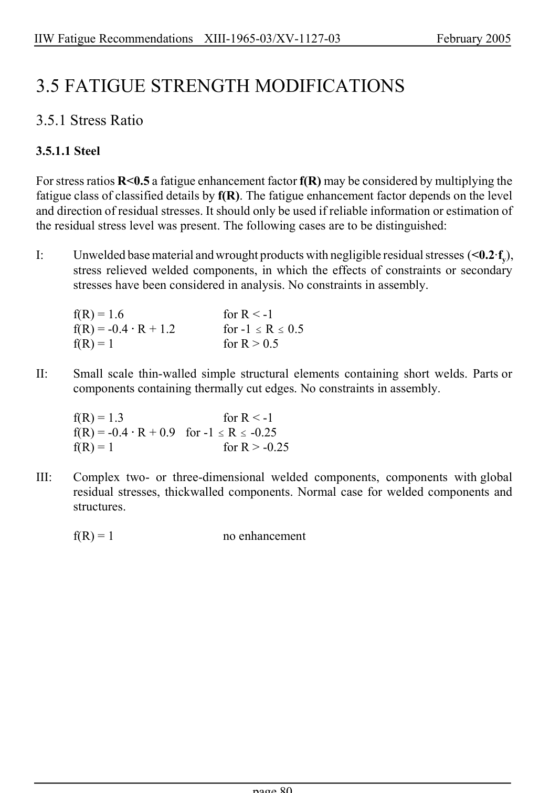

# 3.3–3.8 — Local methods, modifications and imperfections — pagina PDF 80

Fonte: [IIW — Recommendations for Fatigue Design of Welded Joints and Components](../../sources/iiw.pdf#page=80). Pagina stampata: 80.

> Formule, simboli e associazioni delle tabelle non sono convalidati per il calcolo.

## Testo estratto

IIW Fatigue Recommendations  XIII-1965-03/XV-1127-03                 February 2005

3.5 FATIGUE STRENGTH MODIFICATIONS

3.5.1 Stress Ratio

3.5.1.1 Steel

For stress ratios R<0.5 a fatigue enhancement factor f(R) may be considered by multiplying the fatigue class of classified details by f(R). The fatigue enhancement factor depends on the level and direction of residual stresses. It should only be used if reliable information or estimation of the residual stress level was present. The following cases are to be distinguished:

```text
I:     Unwelded base material and wrought products with negligible residual stresses (<0.2Afy),
        stress relieved welded components, in which the effects of constraints or secondary
        stresses have been considered in analysis. No constraints in assembly.
```

```text
       f(R) = 1.6                    for R < -1
       f(R) = -0.4 @ R + 1.2          for -1 # R # 0.5
       f(R) = 1                      for R > 0.5
```

II:    Small scale thin-walled simple structural elements containing short welds. Parts or components containing thermally cut edges. No constraints in assembly.

```text
       f(R) = 1.3                    for R < -1
       f(R) = -0.4 @ R + 0.9  for -1 # R # -0.25
       f(R) = 1                      for R > -0.25
```

```text
III:   Complex two- or three-dimensional welded components, components with global
        residual stresses, thickwalled components. Normal case for welded components and
        structures.
```

f(R) = 1                 no enhancement

page 80

## Pagina di riscontro


