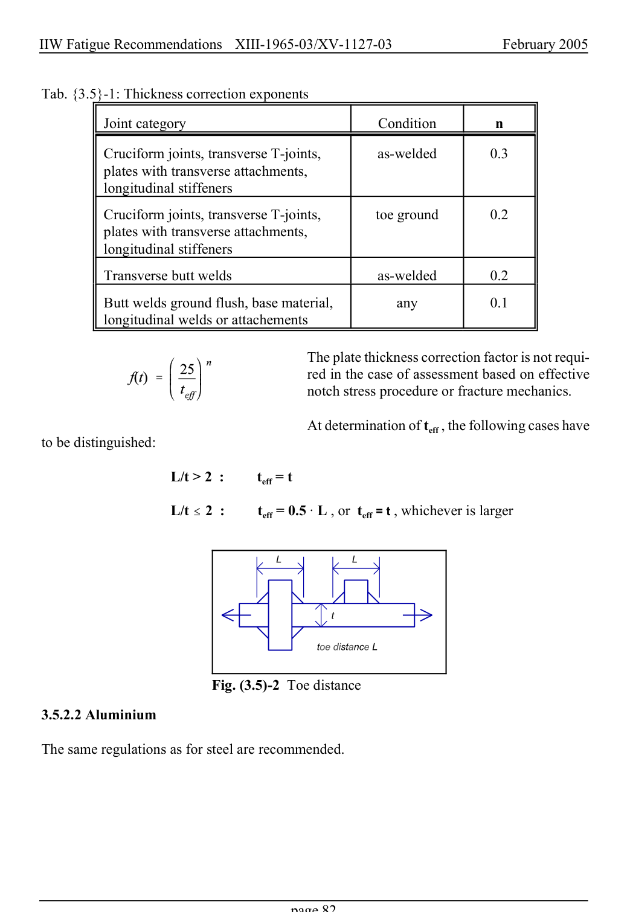

# 3.3–3.8 — Local methods, modifications and imperfections — pagina PDF 82

Fonte: [IIW — Recommendations for Fatigue Design of Welded Joints and Components](../../sources/iiw.pdf#page=82). Pagina stampata: 82.

> Formule, simboli e associazioni delle tabelle non sono convalidati per il calcolo.

## Testo estratto

IIW Fatigue Recommendations  XIII-1965-03/XV-1127-03                 February 2005

Tab. {3.5}-1: Thickness correction exponents

Joint category                              Condition       n

```text
          Cruciform joints, transverse T-joints,         as-welded         0.3
           plates with transverse attachments,
           longitudinal stiffeners
```

```text
          Cruciform joints, transverse T-joints,         toe ground        0.2
           plates with transverse attachments,
           longitudinal stiffeners
```

Transverse butt welds                      as-welded         0.2

Butt welds ground flush, base material,         any            0.1 longitudinal welds or attachements

The plate thickness correction factor is not requi- red in the case of assessment based on effective notch stress procedure or fracture mechanics.

At determination of teff , the following cases have to be distinguished:

L/t > 2  :         teff = t

L/t # 2  :         teff = 0.5 A L , or  teff = t , whichever is larger

Fig. (3.5)-2 Toe distance

3.5.2.2 Aluminium

The same regulations as for steel are recommended.

page 82

## Pagina di riscontro


